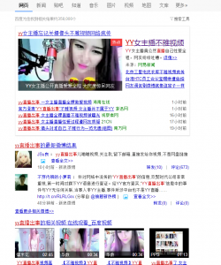

我还记得原来看TED的一个演讲视频，主讲人选择的题目是互联网与责任。里面有一句话：你点击了什么，就决定了互联网上什么会更受欢迎，什么会越来越多。很多人忽略了这一点，他们认为访问网站是一种私人的行为，可以游走于道德之外的禁区。其实不然，柴静的《看见》里有一句：他人承受的，我必承受。

最近几个月网上一直不太平，先是优衣库，然后htc，接着九眼桥，现在是yy。早上一起来，“yy直播出事”的消息就上了百度头条。点进去一看，是这样的：

上一次优衣库事件以后，上微博就像上黄色网站，现在上微博像逛窑子了。不仅是微博，百度知道也沦陷了。上知道搜索“yy直播出事”，二十页搜索结果，全是8月8日的问题。

大众的狂欢。

太久没有得到释放的欲望终于可以以一个堂而皇之的理由发泄。社会中掌控话语权的大多数是男性，而对于他人隐私的窥探是男人的本性，阿尔弗雷德 希区柯克的《后窗》就讲了一个这样的故事。况且人性中总有一种幸灾乐祸，只是平时你没有理由这么去做，因为有道德束缚着你，你还有行为的底线。但是在这样一场狂欢中，不存在任何的道德可言。自媒体时代给了信息极快的传播速度，同时也给了人们一个自由发泄的空间。这个小屋是我的发泄空间，整个互联网却是一批掌握着话语权的人的发泄空间。

于是乎，为了发泄自己的欲望，整个互联网就再没有隐私可言。有些人看到其中有利可图，就不惜售卖自己的隐私，把它作为一种商品，去迎合人们的需要。一唱一和中，各得所利，一场好戏。

在这戏中，我们都是沉默的观众。不记得是哪位记者说过一句话：“自媒体时代我们就像孤岛。人人都在发声，但是没有人倾听。”

所以我就想，到底是互联网时代的浮躁造就了我们的势利，还是我们的势利改变了这个时代。

非诚勿扰有一期节目，男嘉宾上来说：“我是做养殖工作的，月收入两千元左右。”第三段vcr放完以后，全场女嘉宾都灭灯了。走之前他说：“其实我名下还有几套房产，每个月租金能有七八万。”全场女嘉宾沉默一会，都要求重新亮灯。

有学校禁止早恋，准确的是全中国都禁止早恋，其实我觉得没必要，不如让我们体会一下不与金钱挂钩的感情是什么滋味。免得长大以后没娶到自己所爱的人，却娶到了一堆人民币。

我一直认为一夜爆红是不存在的，厚积薄发才是成功的正道。但互联网时代却给无数人提供了这种机会。于是乎，真人秀上“感人”故事满天飞，家里人不出点事你都不好意思上电视。枯燥重复的主流价值观一次又一次的刷新我的下限，难道这就是我们所需要的“励志”？

很早以前就有一种观点：互联网是一把双刃剑，但很显然我们用它伤到了自己。在信息传播速度很慢的古代，要让大众有一个同时狂欢的理由相当不易，就像一场政变总需要很长时间一样；但是现在不同了，一分钟，互联网就可以捧红一件事，也可以让另一件事彻底地沉入大海。浮浮沉沉中，观众换了好几茬，演员也是各出奇招。总之，一个愿打，一个愿挨。

鲁迅先生有一句话：“一见到短袖子，立刻想到白臂膊，立刻想到全裸体，立刻想到生殖器，立刻想到性交，立刻想到杂交，立刻想到私生子。中国人的想像惟在这一层能够如此飞跃。”不知道还有多少人，举着高尚的旗子，背地里干着什么样龌龊的事情。网络是他们最后一层遮羞布。

回到开头，网络世界里我们也有需要遵守的规则。你点击什么，互联网就会充斥着什么，商人毕竟唯利是图。这道理放在社会里也一样——你做了什么，决定了这个社会是什么样。有人觉得我一个人的力量不够，其实不然，一亿个人都做同样的事的话，社会就不一样了。改变他人没有意义，独善其身就好。

最后最后，不要做一个狂欢的鼓动者，不要为本已浮躁的社会推波助澜。求真务实，亲力亲为，不做键盘侠。

从我做起。