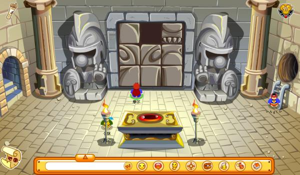

周末回来上空间，发现有人发了怀念摩尔庄园的说说，里面提到说摩尔庄园停止更新了。我再去登录游戏，发现游戏里面的时报停在了2015年2月6号。时报首页有一个链接，通向摩尔庄园论坛的，里面全是纪念过去的文章，还有一些对淘米停更的抱怨与惋惜，当然还有关于摩尔庄园停止更新的公告。我翻了几页，找到了一个蛮有意思的帖子，它里面是许多年以前摩尔庄园的截图，其中有一张让我觉得很难受：

之所以选这张图，是因为图片里的拼图曾经是摩尔庄园最难的谜题没有之一。我记得原来小学不懂拼图，周五回家就开始解谜，周日下午才搞定，那是三四年级的事情了。顺带一提，摩尔庄园是每周五更新的，知音漫客也是每周五出新一期，这两样东西在小学的我心中占据了重要事物排行榜前两位，第三位是淘气包马小跳。

登陆上了摩尔庄园还是让我蛮开心，本来很多游戏都是停止更新后不久就停服的。选择了一个没人的服务器（尽管仅剩的七八个服务器里都没什么人），我打开人物资料，上面写着：生日是2008年11月2日。九岁开始玩摩尔庄园，到现在七年了，我的米米号还是八位数1开头，现在新注册的米米号都是3开头。再去摩尔城堡附近逛了一圈，除了看见么么公主登基了之外，其他什么都没看到。我记得很多年以前她还只是一个公主，老国王去世以后，一直被骑士团守护着。我也是骑士团成员之一。然后再是好友列表，一片黑色，当然我根本没期望过有人能上线。不管怎么说，摩尔庄园成为古董了，我只有怀念的权利。

上小学三年级的时候，摩尔庄园刚刚开始增值业务，就是有了类似于vip的超级拉姆，一个月十块。那时候的淘米不可一世，毕竟淘米旗下的赛尔号还是那个时候小学生初中生的首选游戏，学校里我和我身边的很多同学都在聊淘米有一天一定会坠落的，因为他们心中只想着钱，哪知道七年后的今天诅咒居然灵验了，实在是始料未及。我记得淘米做摩尔庄园动画，野心很大，结果没有战胜喜羊羊；做大电影，还是没有战胜喜羊羊。淘米本来有机会成为中国最大的低龄游戏制作商，但是他们下错了棋。疯狂的扩张与源源不断的资金投入，换回来的却是一次又一次的失败，钱都打了水漂。现在淘米和4399一起做合作，估计也是无奈之举，要知道，4399当年为了破解摩尔庄园12点之后不能登录的限制可是拼尽全力，最终推出摩尔庄园夜间版。当年的敌人为了利益走到一起，不知道该是欢喜还是悲伤。

对摩尔庄园的怀念，其实也是对我自己的怀念吧。至少原来在摩尔庄园里，我的名字就叫邓浩然，不像现在的网络游戏，每个人都努力隐藏自己，像一片深海里看不清水草的鱼。我不确定是我们变浮躁了还是我们本来就很浮躁，有可能摩尔庄园减缓了浮躁迸发的过程，也有可能摩尔庄园事实上什么都没有改变。万物均衡，轮回之间，十年之前辉煌的，十年之后也可能消逝，在边缘挣扎。

最后还是要说一句，非常，非常非常感谢七年前的淘米。当初是我说错了，你们最早的主创人员心里肯定不止有钱，因为你们能编出么么公主和RK的故事，然后让我相信了好久。