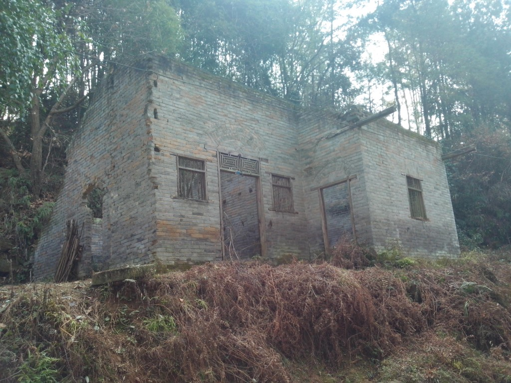
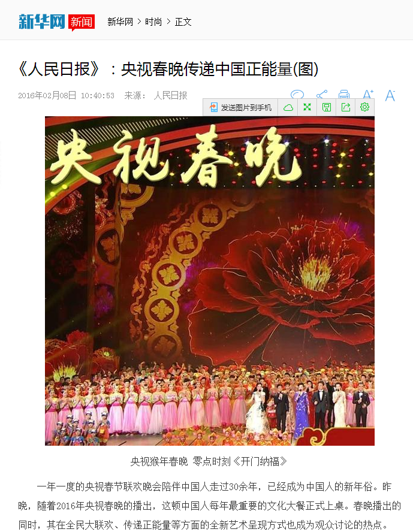

现在是中国新年的第二天，也就是大年初二的晚上。选在今天写这个话题，一是时间充裕，因为昨天完成了走亲访友的任务；二是我懒，放假后拖了很久没有写东西，今天想起来就写点。不过这些天虽然没有写东西，观察倒一直没有停过。特别是下乡的日子，还有上街到处游荡的日子，都遇见了不少人，不少事。

首先说说农村。中国文化的起点是在农村，因为我们从农耕文明发展而来。离万家镇不远的地方有一座沙县小学，开车经过的时候，我看见它大门敞开，一群孩子在里面打乒乓球，以及打篮球。前几天我去达一中，达州市排名前三的学校，保安不开门，我拿出学生证，她说学生也不能给你开。我记得以前提倡全民健身，现在觉得是放屁，健身的地方都没有还怎么健身。说担心东西损坏纯粹是托辞，你看沙县小学怎么不怕？愈大而愈无当。碗厂中心小学门口挂着一条横幅：“均衡教育资源”，我看着都觉得挺有意思——城里的学校努力提高升学率，农村的学校努力平衡资源。

农村与城市的隔阂远不止这一点点。过年很多人回乡，路上挨着挨着都是车。大年三十最堵，初一反而空旷，因为初一很多人都选择步行去走亲访友。车牌很有意思，有广东的、福建的、西藏的。千里迢迢开车赶回家乡，恐怕不只是为了见见亲人，更多的是要告诉乡亲们自己在外面混的多么好。住在我老家楼下有一户人家的孩子就是开着高级轿车回乡，他家去年花了两三万修缮了门前的道路，尽管那孩子在北京只是普通的打工仔，收入并不高，只能在五环边上租房子，但是他还是要打肿脸充胖子。量力而行是没人相信的，装蒜才是大家追求的目标。平常回老家一个半小时车程，过年花了三个多小时，我坐在车里，街上来来往往许多挺着啤酒肚的看起来蛮成功的人，我觉得挺有意思——他们大多数从农村走出去，没有把繁华带回来，只带回来了繁华的自己。

这次回老家主要是看奶奶，她去年走的，那时候我还在期末考试，生物刚刚考完。去看她最后一面的时候，呼吸机放在一边，噪音蛮大，我和大爸、幺爸和三个哥哥姐姐站在ICU里。最后我第一个离开，实在忍不下去了，你看着最爱的亲人受苦，但是你无能为力。新年去上坟，本来想跟奶奶单独说几句话，可惜没有机会，一群亲戚朋友站在一边祈求保佑，一边笑笑说：“你们孩子要多烧点纸，这样奶奶才能贿赂阎王，让你们考上好大学”。烧纸的时候烟雾满天飞，灰色的尘埃顺着风向上，他们说这是奶奶拿走了钱。我很无语，放鞭炮的时候我站在一边捂着耳朵，觉得很吵。我觉得墓园应该是很安静的，却总有人借着热闹、传统的名义去那里捣乱，他们平常都不会想起逝去的亲人，到了他们的坟前才想起自己多久没有来过这里。奇怪的事。

奇怪的事不止这一件。奶奶是上午出门晒太阳，突发脑梗阻，右半身一下子没了知觉，倒在地上。不知道是谁从奶奶的兜里摸出手机，给父亲打去了电话。赶到花园的时候，一大群人围在旁边看着，只有一个四十岁左右的中年人扶着奶奶。父亲走进去，围观的人不停喊：“这个老人自己倒的，跟那个男的没有关系！”父亲走过去，把奶奶抱上救护车，回过头对所有人说了句谢谢。这是后来父亲给我讲的了，那是我第一次看见他哭。

奶奶走了之后爷爷就一个人住在老屋里，办葬礼的时候他跑上跑下，但是一直没帮上什么忙，只是看着父亲三兄弟在安排。葬礼办得很奇怪，十几个后人跟在后面，八个“金刚”抬着奶奶的棺椁走在前面。直到下葬的地方为止，路上只要“金刚”们想休息，我们就得跪下。我记得那天在下雨，敲锣打鼓吹唢呐的跟在一边，卖力地吹，脸胀成绛紫色。父亲后来说这是农村的习俗，主要是为了让爷爷开心。初一的时候爷爷和我们一块回到城里，每天要么坐在窗边不说话，要么就盯着电视机，不知道到底看没看。爷爷的听力也越来越差，今天我父亲让他去十五楼，他却走到了十二楼，最后还是我一层一层地找下去，在十二楼看到了他。父亲说爷爷年轻时会上山砍最粗的树，然后盖房子，他还会做泥瓦工。但是我总觉得他很孤独，我爸劝说让他来城里玩几天的时候，我在爷爷眼睛里只看到了空洞，那里没任何的感情。

过年之前跟于霖和邵文杨一块出去吃饭，在巴西烤肉，自助餐，服务员会带上某种菜品走到你桌子旁边问你需要吗。菜的味道不错，吃的也很开心，我们聊了很多。突然后面一桌食客摔了盘子，并且猛地敲桌子，开始大吼。看了半天，我才搞清楚事情也就是一位上菜的服务员问那位客人需要某种菜品吗，那位客人说不用，之后服务生却又被叫去，然后再被支走，到头来客人仍然没有要那种菜品。最后服务员忍不住，说了一句：“好烦”，客人于是大发雷霆，吼叫着：“我来这里花钱吃饭是来受罪的吗？那个服务员必须给我道歉”最后服务员道了歉，餐厅的经理又解释了半天，那客人才作罢，起身离开。我想起初中生韩老师对我说：“没人应该为你做任何事，所以把谢谢放在嘴边”。钱让我们变得浮躁，因为我们恃钱放荡。

中国过去建筑留了很多有意思的东西，这次回乡我还找到了一间房子，可能有二三十年了吧，照片在下面：

这房子离坍塌不远了，但是结构仍然完整，能看到有几间屋子，而且它的正面上面用砖拼接出了一个五角星，可能在照片上看不大清楚，但是它的棱角是很整齐的，要知道那时候没有车床，只有刻刀。我打算进去看看，大爸却把我拦住：“危房，有什么好看的”。中国绝大多数老房子都是一样的处境——新的楼房一天比一天密集，它们却倒的倒、塌的塌。父亲也举过一个简单的例子：爷爷去世之后，谁还会回老家去？大爸幺爸都在城里买了房子，几十年以后，我当爷爷的时候，老家恐怕也跟图片里的房子相差无几了。没人再回原地，见证历史的东西就死在阴暗的角落里，只有少数几个幸存者，打着古典建筑的旗号，每天被潮水般的人群淹没，以另一种方式缓缓死去。我们的文化也就跟建筑一样，在慢性自杀。

今年的春晚有多难看？我无法形容，从最开始的吉祥物设计到节目编排，一塌糊涂。但是看新华网发文章，春晚有深度，有内涵，切合社会主义核心价值观，几百个机器人一块跳舞能激发人们的创新意识，几个小丑上台念剧本叫做反映社会现实的小品，帅哥美女们唱歌跳舞叫做彰显中国文化。我没什么话可说，只知道这篇文章的评论里只有一个人祝大家新年快乐。新闻联播也在表扬它，今年春晚的收视率比去年还高，海外华侨对春晚好评率达到95%

这是新闻截图：

我想起耍猴，耍猴人一鞭子，猴就跳，观众就叫好，有时候猴子不听话，就再来一鞭子，观众再叫好，猴子也不吭声了。这就是为什么，猴子种群的文化没有延续到今天，倒是人类，心心念念着猴，甚至把它排进了十二生肖。

六小龄童上春晚的事情一开始炒的很火热，很多人在网上说为了情怀，为了童年，但是他们没想过他们的童年其实也并非全是真相。周星驰的孙悟空我喜欢，六小龄童的孙悟空我也喜欢，但是我不喜欢六小龄童去批评周星驰曲解原著祸害后代，86版西游记其实也对原著进行了很大改动才得以上映，而且它的受众是几乎没看过西游记原著的青少年。1号的孙悟空和2号的孙悟空一块表演，真假难分，重要的是观众还不是如来佛祖，而且真孙悟空躺在书里。这篇文章会告诉你很多事情：
http://app.myzaker.com/news/article.php?pk=56aaccc09490cbe71f000070

这文章里有一句话我很喜欢：没有最好，只是理解不一样，一百个读者就有一百个哈姆雷特。我可能不太理解中国的春晚，不太理解中国的传统，不太理解中国的文化，我可能错了，可能这就是最好。台湾地震，一群人在网上欢呼终于杀了台独分子，真解气。

哈哈哈哈哈哈哈哈哈哈哈哈哈哈哈哈。