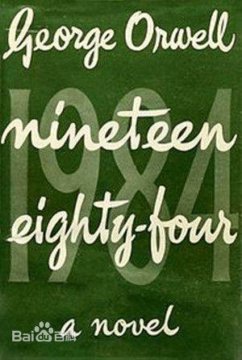
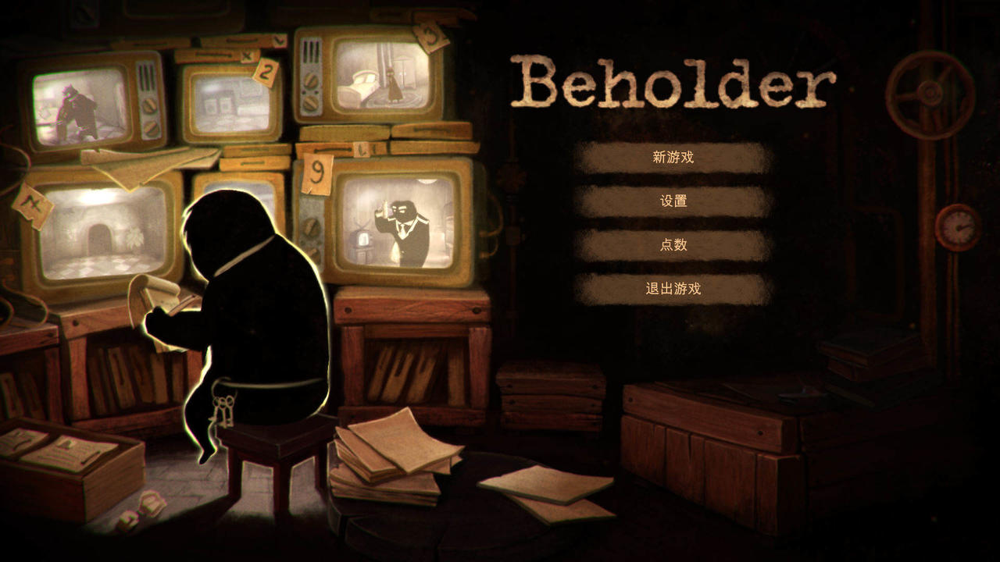
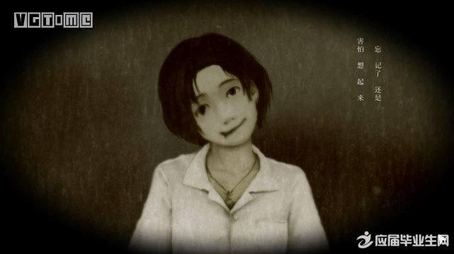
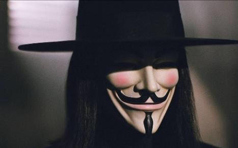
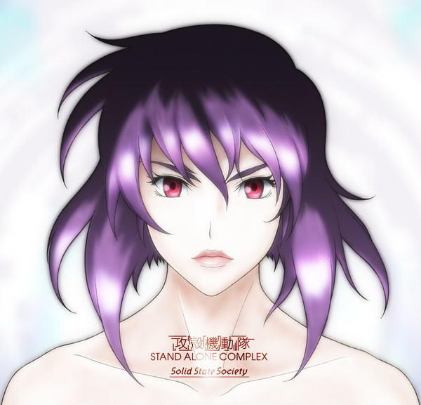

# 文学

1948年的时候，乔治奥威尔完成了《1984》。这是他的第二部小说，这位只活了47岁的作家一生只写了两部小说，第一部叫动物庄园。特朗普上台的时候，美国亚马逊上《1984》的销量暴涨了9500%。

    
    

        1984早就被许多书评杂志列为一生必看的小说之一
    

1984描写了一个令人感到窒息的极权社会，在那个社会中，个人被完全消灭，集体的利益大于一切，而且个人崇拜演化到了宗教的地步，战争的进行甚至只是为了社会的正常运行。这种集权制度与天灾导致的毁灭不同，它是人为的思想毁灭。乔治奥威尔在1948年就预见到了这一切，并且开创了一个新的文学流派——反乌托邦。

乌托邦这个词，最早是柏拉图提出来的。柏拉图是个太理想的人，他看身边的一切就像高度近视的人取下眼镜，只能看见朝他疾驶而来的汽车周围一圈淡淡光影的轮廓。他会赞叹光影的美丽，殊不知汽车就要夺走他的生命。

后来英国的一个空想社会主义者，托马斯莫尔，在他的名著《乌托邦》里虚构了一个航海家来到了一个世外桃源般的世界：那里财产公有，人们平均分配资源，简直就是社会主义的美好蓝图。只可惜，托马斯莫尔是个“空想”社会主义者，他一生都没有机会在现实里实现自己的消灭私有制的理想。

    
    

        托马斯莫尔
    

反乌托邦文学，顾名思义，就是打碎那些泡沫般的理想，用残酷的想象来反映时下社会中的问题，警示人们潜在的危险。世界三大反乌托邦小说——《1984》《我们》《美丽新世界》——无一例外的掺杂了作者对于未来恐怖社会的想象。例如在《美丽新世界》中，人们就被一种名叫唆麻的药物所操控。

# 游戏

说了这么多文学方面的东西，终于可以开始聊聊游戏里的反乌托邦元素了。

## replica

我接触的第一款真正意义上的反乌托邦游戏，是replica，中文翻译叫复制。

    
    

        replica也是拿奖到手软
    

replica讲述的是玩家扮演的主人公被国家机关囚禁起来，并且被要求去检查一位你素昧平生的男孩的手机，否则你将不会被释放。游戏中你可以按照指令一步一步地去探寻他人的隐私，也可以违背指令，努力地“解放”自己。这款游戏最震撼人心的地方在于，当你按照指令完成了所有任务时，你会突然发现自己已经不自觉成为了国家的鹰犬。游戏结束时屏幕上会弹出三行字：

**WAR IS PEACE（战争即和平）**

**FREEDOM IS SLAVERY（自由即奴役）**

**IGNORANCE IS STRENGTH（无知即力量）**

这是1984里最经典的一句话之一，尤其是那句无知即力量，发人深省。另外，replica的音乐也非常好听，我最喜欢的是那首missing，想听一下的朋友可以去这里：[bgm试听](https://www.bilibili.com/video/av5571886)

## beholder

另一款给我留下深刻印象的反乌托邦游戏是beholder，中文译名旁观者。游戏中玩家需要扮演一名国家指派的公寓管理员，被剥夺了睡眠的权利，必须要每天24小时监视房客们的一举一动，并且向国家举报来得到自己的工资。但是游戏里远不仅仅让你成为一台机器，你可以做出选择，你可以选择做好事，比如帮助一对夫妇逃离这个可怖的国家，但是做好事的代价事，你没有钱来救自己女儿的命，你也没有钱来贿赂儿子的大学教授。

我第一次通关时做了一个好人，结果女儿病死，第二次通关时我疯狂地敲诈勒索，在房间里放满监视器，一动不动地紧盯着电脑屏幕，他们的任何风吹草动我都了如指掌，我甚至背诵了国家法律里有哪些违禁品。这一次我救了自己的女儿，但是我被枪杀了，被我屡次勒索的那位房客枪杀。这是他对我的复仇。

我突然想起《无间道》里那句经典的台词：我想做个好人。

    
    

        左侧的几台电视机其实就概括了游戏的大部分内容
    

旁观者是我玩过的为数不多让我觉得揪心到玩不下去的游戏，也许现实远比它残酷。旁观者新推出的DLC名字叫安乐死，我居然不想再去体验一遍。

## 返校

另外还得说说一款国产游戏，《返校》，严格意义上说，它并不是反乌托邦类型的游戏，但它描写的台湾戒严时期的恐怖社会，本身就是最好的反乌托邦范例。关于这段时期的背景，可以参考机核网的这篇文章：[返校历史背景介绍](http://www.g-cores.com/articles/22672)

我今天主要聊聊游戏本身。

    
    

        这个邪魅一笑成了不少玩家的心理阴影
    

《返校》是一款足够优秀的恐怖游戏，无论是在气氛营造还是故事叙述上，都有许多亮点。阴暗的环境，以及场景中布置的有关宗教的道具，比如蜡烛、佛龛等等，都让我在游玩时心中捏了一把汗。而且返校中有许多介绍故事背景的小道具，从中能窥见白色恐怖时代的人心惶惶和疯狂。终究来说，政治是人发明的东西，所有的政治问题，都是人的问题。

值得一提的是，《返校》的英文名字，detention，原意是拘留。

# 电影

## V字仇杀队

反乌托邦的电影，首推V字仇杀队。不是说它多么好看，只是说它给人们带来的影响。

    
    

        不少叛逆的服饰上都会印着这张脸
    

由DC漫画改变的超级英雄电影——V字仇杀队——实际上只讲了一个俗套的故事，革命与反革命。其中最经典的一句台词莫过于：人民不应该害怕他们的政府，政府应该害怕他们的人民。

在我看来，片中主角V，就是上图那个总是戴着面具的满头长发的人，其实挺像切格瓦拉，在别人看来他们都是超人，为了自由而奋斗不息，但是其实他们都是平常人，就像V的尸体被炸弹炸毁，切格瓦拉被玻利维亚军队杀害。他们只是告诉大家，你们有自由的权利，这远比用革命推翻一个政权更要影响深远。

## 攻壳机动队

攻壳机动队的电影版本只有三部，包括押井守监督的攻壳机动队、攻壳机动队2：无罪，还有斯嘉丽约翰逊主演的攻壳机动队真人版。另外攻壳机动队还有两部TV版，分别是SAC和GIG。它们都是从士郎正宗原作的漫画改编而来。

    
    

        很长一段时间我无法接受其他的日本动画
    

攻壳机动队的漫画从1989年开始连载，讲述了在虚构的未来，人们的大脑大多数都被替换成“电子脑”，在脖颈后留有几个USB接口，而且人们的四肢也被替换成更为坚固且易于更换的“义体”，就跟尼尔机械纪元的设定差不多。主角草雉素子，就是上图中的妹子，是公安九课的一名警员，专门负责与电子脑相关的刑事犯罪案件，她周围的同事都称呼她“少佐”。她很小时就全身义体化，并且非常擅长黑客战。

攻壳机动队电影版的第一部讲述的就是草雉素子在全身义体化后探寻“自我”的故事，押井守在电影里探讨了许多牛逼闪闪的哲学命题，有兴趣的朋友可以自己去欣赏欣赏。

攻壳机动队TV版第一部最后几集，公安九课因为某种原因成为了政治的牺牲品，而整个TV版的第二部，都在影射日本政治的不堪之处。

    
    

        攻壳机动队TV版第一部中主要人物笑面男的标志
    

值得一提的是，上面那个标志周围的一圈英文句子出自《麦田里的守望者》，大致意思是“我觉得我只需要成为一个傻子、聋子和哑巴”。

罗素在西方哲学史里有一句话：科学帮助人们生产，哲学指导人们使用科学。攻壳机动队描写的未来不算非常黑暗，但是却是一个哲学发展远远落后于科学的时代。如果我们全身都被替换成了机械，我们还存在吗？这在某种意义上说是一种科学对人类自己的反噬，就像那个叫做弗兰肯斯坦的科学怪人一样。

尼尔机械纪元里有一位道具商人，操控2B帮他完成收集材料的任务后，他答应帮2B修理物品，但是2B问他，明明还有多余的材料，你为什么不把自己受伤的右腿替换成机械的呢？道具商人回答2B：“这是我身上唯一还属于自己的东西了。”

豆瓣上评论攻壳机动队：上乘银翼杀手，下启黑客帝国。但其实它们都有个共同的祖先：《神经漫游者》，赛博朋客的鼻祖，唯一一本同时拿了雨果奖、星云奖和菲利普迪克奖的小说。当然这是另外一个文化流派了，在此不再赘述。

# 结语

反乌托邦作为一种文化类型，有其存在的意义，应该说世上的一切，都有其存在的价值。当然，我相信每一个尽力描写着着反乌托邦的人，都一定含泪在等待乌托邦的到来。你不能阻止一个喜爱太阳的人抱怨月亮不够明亮，因为或许我们一生都活在黑夜中。