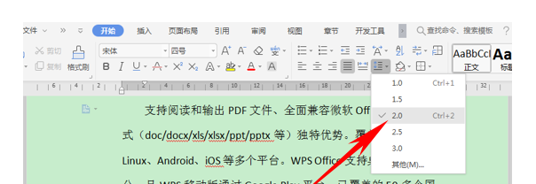

键盘锁定：
    
    sc config i8042prt start= disabled

U盘出现的一个问题
错误0x800700ea:有更多数据可用
U盘的文件系统:FAT32
将U盘的文件系统格式化为NTFS(注意提前备份好原有文件）

板子：

```c++
#include <bits/stdc++.h>
#define int long long
#define sci(a) scanf("%lld",&a)
#define scii(a,b) scanf("%lld%lld",&a,&b)
#define sciii(a,b,c) scanf("%lld%lld%lld",&a,&b,&c)
#define scc(a) scanf("%c",&a)
#define scs(a) scanf("%s",a)
#define pri(a) printf("%lld",a)
#define prc(a) printf("%c",a)
#define prs() printf(" ")
#define prn() printf("\n")
#define re(i,a,b) for(int i=a;i<=b;++i)
#define fo(i,a,b) for(int i=a;i<b;++i)
#define rre(i,a,b) for(int i=a;i>=b;--i)
#define each(i,a) for(auto i=a.begin();i!=a.end();++i)
#define body(a) a.begin(),a.end()
#define mkp make_pair
#define fst first
#define snd second
#define frt front
#define bak back
#define pub(a) push_back(a)
#define pob pop_back
#define puf(a) push_front(a)
#define pof pop_front
#define mem0(a) memset(a,0,sizeof(a))
#define memmx(a) memset(a,0x3f3f,sizeof(a))
#define memmn(a) memset(a,-0x3f3f,sizeof(a))
#define nmsl cout<<"NMSL"<<endl
#define Yes cout<<"Yes"<<endl
#define No cout<<"No"<<endl
#define FAST ios_base::sync_with_stdio(0);cin.tie(0),cout.tie(0);
#define endl '\n'
#define lbd lower_bound
using namespace std;
typedef long double db;
typedef pair<int,int> pii;
typedef pair<db,int> pdi;
typedef vector<int> vei;
typedef vector<pii> vep;
typedef vector<char> vec;
typedef vector<string> ves;
typedef map<int,int> mpii;
typedef map<pii,int> mppi;
typedef map<char,int> mpci;
typedef map<string,int> mpsi;
typedef deque<int> dqi;
typedef deque<pii> dqp;
typedef deque<char> dqc;
typedef deque<string> dqs;
typedef priority_queue<int> mxpi;
typedef priority_queue<int,vei,greater<int>> mnpi;
typedef priority_queue<pii> mxpp;
typedef priority_queue<pii,vep,greater<pii>> mnpp;
const int maxn=500005;
const int inf=0x3f3f3f3f3f3f3f3f;
const db eps=1e-10;
const db pi=3.1415926535;
int lowb(int x){return x&-x;}
int mmax(int a,int b,int c){return max(max(a,b),c);}
int mmin(int a,int b,int c){return min(min(a,b),c);}
int count2(int x){return __builtin_popcountll(x);}
int ll(int p){return p<<1;}
int rr(int p){return p<<1|1;}
int mm(int l,int r){return (l+r)/2;}
int lg(int x){if(x==0) return 1;return (int)log2(x)+1;}
bool smleql(db a,db b){if(a<b||fabs(a-b)<=eps)return true;return false;}
bool bigeql(db a,db b){if(a>b||fabs(a-b)<=eps)return true;return false;}
bool eql(db a,db b){if(fabs(a-b)<eps) return 1;return 0;}
db len(db a,db b,db c,db d){return sqrt((a-c)*(a-c)+(b-d)*(b-d));}
int gcd(int x,int y){return __gcd(x,y);}
int lcm(int x,int y){return x*y/__gcd(x,y);}
bool isp(int x){if(x==1)return false;if(x==2)return true;for(int i=2;i*i<=x;++i)if(x%i==0)return false;return true;}
int qpow(int a,int b,int mod){int tmp=a%mod,ans=1;while(b){if(b&1) ans=(ans*tmp)%mod;tmp=(tmp*tmp)%mod;b>>=1;}return ans;}
inline int read(){char ch=getchar();int s=0,w=1;while(ch<48||ch>57){if(ch=='-')w=-1;ch=getchar();}while(ch>=48&&ch<=57){s=(s<<1)+(s<<3)+ch-48;ch=getchar();}return s*w;}
inline void write(int x){if(x<0)putchar('-'),x=-x;if(x>9)write(x/10);putchar(x%10+48);}

signed main() {
    FAST

    return 0;
}
```

如何开启笔记本的蓝牙： win10蓝牙在开始页面的齿轮处选择设备即可开启

**尽量转成pdf再交付打印**

wps调整行间距的方法：



wps插入横线：插入-形状-线条
wps打开网格线：视图-网格线（用于处理文档对齐）
wps打勾：插入-符号-√
wps在行首插入项目标记（就是一个原点或者序号）：右键-插入项目符号和编号

一些有用的网站：
pdf转word： https://smallpdf.com/cn/pdf-to-word 
在线代码高亮：http://www.planetb.ca/syntax-highlight-word
在线Latex：https://zh.numberempire.com/latexequationeditor.php
**注意代码高亮复制出来的时候要带格式粘贴**

WPS转PDF报未定义书签的错：
新建的书签要右键更新域才可使用

ctrl+z 撤销
ctrl+y 恢复
ctrl+x 剪切

Casio如何转换进制：
1. 菜单选择基数
2. shift加上log ln等按键转换进制
3. 输入时用十进制，按下=后再获得结果

C语言printf的对齐方法：https://blog.csdn.net/abcdu1/article/details/74926375/