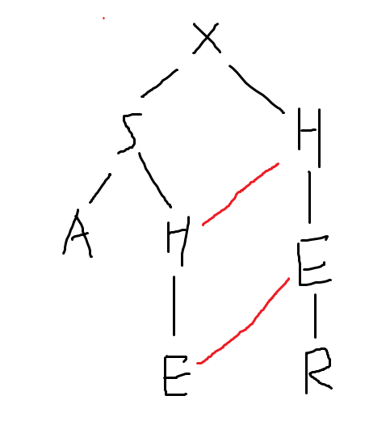
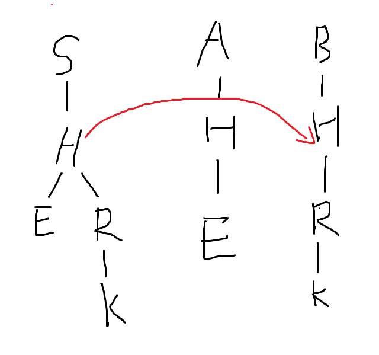

建立在trie树上的kmp，可以进行多模式串的匹配。

即对于一个文本串，返回它与哪些模式串匹配的最后位置的下标，详细参见代码注释。

# 代码

```c++
#define fo(i,a,b) for(int i=a;i<b;++i)
int n,ans[maxn],l2[maxn],same[maxn];
char s[maxn],t[maxn];
queue<int> q;
struct AC_AUTO{
    int c[maxn][26],val[maxn],fail[maxn],cnt;
    int vis[maxn];
    void ins(char *s,int pos) {
        int len=strlen(s),now=0;
        fo(i,0,len) {
            int v=s[i]-'a';
            if(!c[now][v]) c[now][v]=++cnt;
            now=c[now][v];
        }
        if(val[now]) same[pos]=val[now];//same数组用于去重，解决重复模式串的问题
        else val[now]=pos;
    }
    void build() {
        fo(i,0,26)
            if(c[0][i])
                fail[c[0][i]]=0,
                q.push(c[0][i]);
        while(!q.empty()) {
            int u=q.front();
            q.pop();
            fo(i,0,26) {
                if(c[u][i])
                    fail[c[u][i]]=c[fail[u]][i],
                    q.push(c[u][i]);
                else
                    c[u][i]=c[fail[u]][i];
            }
        }
    }
    void query(char *s) {
        int len=strlen(s),now=0;
        fo(i,0,len) {
            now=c[now][s[i]-'a'];
                for(int t=now;t;t=fail[t]) {
                    if(val[t]&&!vis[now])
                    //这里实际上说明下标为val[t]的串在i位置被匹配到了，注意i是匹配结束的位置
                        ans[val[t]]=mmax(ans[val[t]],len-i-1,i-l2[val[t]]+1);
                        //l2是原模式串的长度，用于更新答案。
                }
            vis[now]=1;
            //这里我的理解有误，如果要求某个模式串只能出现一次，这里的vis就必须设置为1，或者也可以把val[t]更改成0
        }
    }
}ac;
```

关于AC自动机的某些有用的性质总结如下：

# 性质1

    fail指针指向与该节点表示串后缀相等的且长度最大的串(或前缀)的节点

读起来有点拗口，实际上挺好理解，比如下面这张图：

<div align=center>
    
    <p style="font-size:14px;color:#C0C0C0;text-decoration:underline">
        fail边示意图1
    </p>
</div>

除了两条红边之外其他所有节点的$fail$边都指向根节点$X$。

# 性质2

通俗来说：

    fail边是与当前后缀位置最长匹配的前缀位置

如下图：

<div align=center>
    
    <p style="font-size:14px;color:#C0C0C0;text-decoration:underline">
        fail边示意图2
    </p>
</div>

# 性质3

有一个问题：如果我建立了一个AC自动机并且把它的fail指针倒序建立成了一棵树，这棵树又有什么性质呢？

对于fail边示意图1建出来的这样的树如下，我们把它称为fail树。

实际上可以理解为每个节点都是一个字符串（类似于回文自动机）：

<div align=center>
    
    <p style="font-size:14px;color:#C0C0C0;text-decoration:underline">
        fail树
    </p>
</div>

考虑这样一个问题：$a$、$b$两串同时处于AC自动机当中，那么$a$串在$b$串中出现了多少次呢？

结论如下：

    每个节点保存一下它属于多少字符串，作为该节点的权值。
    然后某个节点表示的字符串在整个字典中出现的次数相当于其在Fail树中的子树的权值的和。

上图当中，$H$出现了两次，并且$HE$也出现了两次。