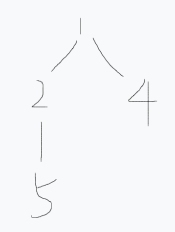
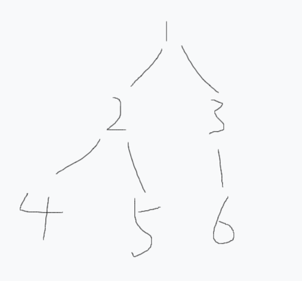
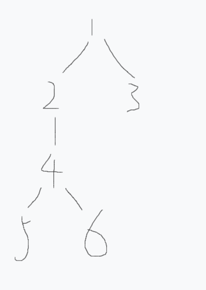

考虑对一棵树维护以下操作：

1. $xy$路径上所有节点权值$+z$
2. 求$xy$路径上所有节点权值和
3. 以$x$为根的子树内所有节点权值$+z$
4. 求$x$为根的子树内节点权值和

树链剖分的想法是是把树拆分成链，再用线段树维护链上的性质。

拆分链的方法是关键，最好使得链的数量保持在logn左右。

定义：

    重儿子为当前节点的包含子节点数最多的那个子节点。

如下图：

<div align=center>
    
    <p style="font-size:14px;color:#C0C0C0;text-decoration:underline">
        树示意图1
    </p>
</div>

其中2是1的重儿子。

那么如何求解重儿子？你需要先准备一大堆数组：

```c++
int head[maxn],to[maxn],e[maxn];//Graph
int sz[maxn],fa[maxn],dep[maxn],son[maxn];//using for d1
int top[maxn],ord[maxn],rord[maxn],last[maxn];//using for d2
int tg,td,tt;//three timers,using for label graph,dfs and segment tree
struct segment_tree{
     int l,r,v,ls,rs,tag;
 };//segment tree
```

之后一遍dfs即可，此外还需要预处理一些其他的信息：

```c++
void d1(int x) {
    sz[x]=1;
    for(int i=head[x];i;i=to[i]){
        int y=e[i];
        if(y==fa[x]) continue;
        fa[y]=x;//change y's father
        dep[y]=dep[x]+1;//the depth of x
        d1(y);
        sz[x]+=sz[y];//change x's size
        if(sz[y]>sz[son[x]])
        son[x]=y;//change the heavy son
    }
}
```

定义：

    重链是由重儿子所组成的链。

**注意重链可能并不互相连接，并且单个点也有可能构成重链。**

如下图：

<div align=center>
    
    <p style="font-size:14px;color:#C0C0C0;text-decoration:underline">
        树示意图2
    </p>
</div>

图中共三条重链：分别是$1\rightarrow2\rightarrow4$、$5$以及$3\rightarrow6$。

树链剖分遵循一种特别的dfs序，处理时一直沿着重链向下，之后处理其他链。

原因有二：

1. 对某个节点，其重链直到叶节点都连续
2. 重链条数维持在$log(n)$附近

```c++
void d2(int x,int t) {
    top[x]=t;//the point on the top of heacy chain
    ord[x]=++td;//the dfs order
    rord[td]=x;//which point dfs order refers to
    if(son[x]) d2(son[x],t);
    for(int i=head[x];i;i=to[i]) {
        int y=e[i];
        if(y!=fa[x]&&y!=son[x])
            d2(y,y);
    }
    last[x]=td;//modify the points under x
}
```

然后建立线段树，注意线段树是建立在$dfs$序上的，时刻注意$ord$和$rord$的关系：

    ord把原来的节点映射到dfs序，rord把dfs序映射回原来的节点。

```c++
void build(int x,int y) {
    ++tt;
    tr[tt].l=x;
    tr[tt].r=y;
    tr[tt].tag=0;
    if(x==y) {
        tr[tt].ls=tr[tt].rs=0;
        tr[tt].v=w[rord[x]];
        return;
    }
    else {
        int tmp=tt,m=x+y>>1;
        tr[tmp].ls=tt+1,build(x,m);
        tr[tmp].rs=tt+1,build(m+1,y);
        up(tmp);
    }
}
```

可以看出这种建立线段树的方式类似于动态开点，所以需要保存左右子节点的指针。

考虑如何使用这种结构维护$xy$的$lca$：

1. 让$xy$所在重链的顶端深度更大的向上跳，直到它们位于同一条重链。
2. 每一次上跳需要跳到当前重链的$top$处，再跳向父节点。
3. 每次$modify$当前节点到重链顶端节点的一段区间，最后维护$x$到$y$的区间。

考虑这样一种情况：

<div align=center>
    
    <p style="font-size:14px;color:#C0C0C0;text-decoration:underline">
        树示意图3
    </p>
</div>

假设$x$为$5$，$y$为$3$：

1. 如果谁深度更大谁跳向重链顶端，$x$会直接跳到$1$，然后再也找不到父亲，陷入死循环。
2. 但是如果比较$x$和$y$所在重链的顶端，会发现$3$的重链顶端深度更大，因为$3$所在的重链就是他本身。
3. 现在$3$上跳，就能顺利找到$lca$。

代码如下：

```c++
void modify_xy(int x,int y,int z) {
    while(top[x]!=top[y]) {
        if(dep[top[x]]>dep[top[y]])
            swap(x,y);
        modify(1,ord[top[y]],ord[y],z);
        //the dfs order of the top point is smaller than the points under it
        y=fa[top[y]];
    }
    if(dep[x]>dep[y]) swap(x,y);
    modify(1,ord[x],ord[y],z);
}
int sum_xy(int x,int y) {
    int ans=0;
    while(top[x]!=top[y]) {
        if(dep[top[x]]>dep[top[y]])
            swap(x,y);
        ans+=sum(1,ord[top[y]],ord[y]);
        ans%=P;
        y=fa[top[y]];
    }
    if(dep[x]>dep[y]) swap(x,y);
    ans+=sum(1,ord[x],ord[y]);
    ans%=P;
    return ans;
}
```

最后考虑如何搞子树。

有这样一个结论：

    实际上一棵子树当中所有节点的编号一定是连续的
    所以last[x]是x所在子树的最后一个叶节点的dfs序
    每次维护子树只需要维护[ord[x],last[x]]这段区间即可

问题迎刃而解。

代码如下：

```c++
void modify_x(int x,int z) {
    modify(1,ord[x],last[x],z);
}
int sum_x(int x) {
    int ans=sum(1,ord[x],last[x]);
    ans%=P;
    return ans;
}
/*
    modify和sum函数按照普通打区间修改标记的线段树写法去搞就好
*/
void up(int p) {
    tr[p].v=tr[tr[p].ls].v+tr[tr[p].rs].v;
}
void down(int p) {
    if(tr[p].tag!=0){
        tr[tr[p].ls].v+=tr[p].tag*(tr[tr[p].ls].r-tr[tr[p].ls].l+1);
        tr[tr[p].rs].v+=tr[p].tag*(tr[tr[p].rs].r-tr[tr[p].rs].l+1);
        tr[tr[p].ls].tag+=tr[p].tag;
        tr[tr[p].rs].tag+=tr[p].tag;
        tr[p].tag=0;
    }
}
int sum(int p,int x,int y) {
    if(x<=tr[p].l&&tr[p].r<=y) return tr[p].v;
    int ans=0,m=tr[p].l+tr[p].r>>1;
    down(p);
    if(x<=m) ans+=sum(tr[p].ls,x,y);
    ans%=P;
    if(y>m) ans+=sum(tr[p].rs,x,y);
    ans%=P;
    up(p);
    return ans;
}
void modify(int p,int x,int y,int z) {
    if(x<=tr[p].l&&tr[p].r<=y) {
        tr[p].v+=z*(tr[p].r-tr[p].l+1);
        tr[p].tag+=z;
        return;
    }
    int m=tr[p].l+tr[p].r>>1;
    down(p);
    if(x<=m) modify(tr[p].ls,x,y,z);
    if(y>m) modify(tr[p].rs,x,y,z);
    up(p);
}
```