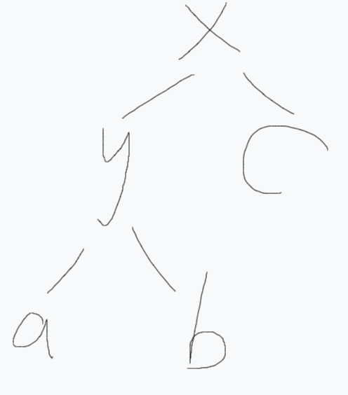
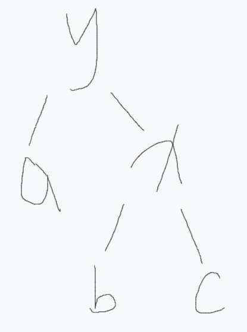

调了一下午，我人都傻了。

二叉查找树的定义：

    左儿子值小于当前节点值，右儿子值大于当前节点值。

查找性能与树深同阶，这意味着树深维持在$O(log(n))$附近时查找性能最优秀。

但是根节点选取不恰当会导致树深接近$O(n)$，退化成一条链。

给出一棵树：

<div align=center>
    
    <p style="font-size:14px;color:#C0C0C0;text-decoration:underline">
        树示意图1
    </p>
</div>

其中$x$、$y$为两个节点，$a$、$b$、$c$为子树。

经过左旋后可以得到：

<div align=center>
    
    <p style="font-size:14px;color:#C0C0C0;text-decoration:underline">
        树示意图2
    </p>
</div>

很容易看出自旋之后没有改变二叉查找树的性质。

一句话总结：

**左旋操作就是令$x_{left}=y_{right}$，令$y_{right}=x$。**

代码如下：

```c++
void spin(int &p,int d) {// d为旋转方向
    int k=s[p][d];
    s[p][d]=s[k][!d];
    s[p][!d]=p;
    up(p);
    up(k);
    p=k;
}
```

事实上$treap$是$tree$和$heap$的结合，它在保证自己满足二叉查找树的性质的同时，为每个节点附加了一个随机值$key$，而且使得$key$满足小顶堆的性质。

每个节点保存如下信息：

1. 储存的值$val$
2. 优先级$key$
3. 左右儿子指针$ls$、$rs$
4. 必要时还需要存储某节点所在子树大小$sz$和节点数字个数$num$

**这样的好处是相同的数字存储到了相同的节点当中去，减少节点数量。**

**此外，手写的inline随机函数可以对运行时间有常数上的优化。**

下面是封装后的结构体，支持查询前缀和后缀的编号，每一次查询一定要记得清空答案：

```c++
struct treap {
    int seed;
    inline int rand(){ seed=seed*49147LL%INT_MAX; return seed; }
    int l[maxn],r[maxn],val[maxn],key[maxn],sz[maxn],w[maxn];
    int tot,rt,ans;
    treap(){ seed=233; }
    inline void up(int p){ sz[p]=sz[l[p]]+sz[r[p]]+w[p]; }
    void lspin(int &k) {
        int t=r[k];
        r[k]=l[t];
        l[t]=k;
        sz[t]=sz[k];
        up(k);
        k=t;
    }
    void rspin(int &k) {
        int t=l[k];
        l[k]=r[t];
        r[t]=k;
        sz[t]=sz[k];
        up(k);
        k=t;
    }
    void ins(int &k,int x){
        if(!k) {
            ++tot;
            k=tot;
            sz[k]=w[k]=1;
            val[k]=x;
            key[k]=rand();
            return;
        }
        sz[k]++;
        if(val[k]==x) w[k]++;
        else if(val[k]<x){
            ins(r[k],x);
            if(key[r[k]]<key[k]) lspin(k);
            //maintain a small heap
        }
        else {
            ins(l[k],x);
            if(key[l[k]]<key[k]) rspin(k);
            //maintain a small heap
        }
    }
    void del(int &k,int x) {
        if(!k) return;
        //can't find x
        if(val[k]==x) {
            if(w[k]>1) {
                w[k]--;
                sz[k]--;
                return;
            }
            if(l[k]==0||r[k]==0)
                k=l[k]+r[k];
            else if(key[l[k]]<key[r[k]]) {
                rspin(k);
                del(k,x);
            }
            else {
                lspin(k);
                del(k,x);
            }
        }
        else if(val[k]<x) {
            sz[k]--;
            del(r[k],x);
        }
        else {
            sz[k]--;
            del(l[k],x);
        }
    }
    int ask(int k,int x) {
        if(!k) return 0;
        if(val[k]==x) return sz[l[k]]+1;
        else if(x>val[k]) return sz[l[k]]+w[k]+ask(r[k],x);
        else return ask(l[k],x);
    }
    int get(int k,int x) {
        if(!k) return 0;
        if(x<=sz[l[k]]) return get(l[k],x);
        else if(x>sz[l[k]]+w[k]) return get(r[k],x-sz[l[k]]-w[k]);
        else return val[k];
    }
    void pre(int k,int x) {
        if(!k) return;
        if(val[k]<x) ans=k,pre(r[k],x);
        else pre(l[k],x);
    }
    void suc(int k,int x){
        if(!k) return;
        if(val[k]>x) ans=k,suc(l[k],x);
        else suc(r[k],x);
    }
};
```