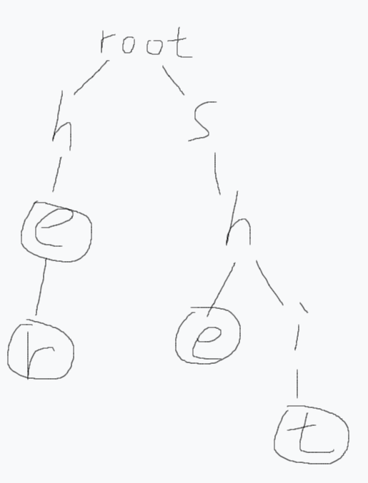

动态开点的祖宗，$AC$自动机的基础，字符串处理的利器，甚至能在上面$dp$。

比如插入单词$he$、$her$、$she$、$shit$之后：

<div align=center>
    
    <p style="font-size:14px;color:#C0C0C0;text-decoration:underline">
        Trie树形态
    </p>
</div>

字典树可以在$O(n)$的时间内找到某个长为$n$的字符串是否在一堆单词中出现过。

可以在节点末尾打上标记，或者记录每个节点被累加了多少次，根据题意不同进行调整。

初始节点全部指向$root$，也就是$0$。

每个节点都要分配一个独一无二的编号，虽然会增大空间消耗。

节点数上限是字符串总长度。

实际上建立一个$trie$数组储存后续指向哪个节点即可，如果那个节点存在，说明那个节点储存着一个对应的字符。

代码如下：

```c++
int tr[maxn][26],tot=1;
bool ed[maxn];
void in(char *s) {
    int l=strlen(s);
    int p=1;
    for(int i=0;i<l;++i) {
        int pos=s[i]-'a';
        if(tr[p][pos]==0)
            tr[p][pos]=++tot;// 新建节点
        p=tr[p][pos];
        ed[p]=1;
    }
}
bool ask(char *s) {
    int l=strlen(s);
    int p=1;
    for(int i=0;i<l;++i) {
        int pos=s[i]-'a';
        p=tr[p][pos];
        if(p==0) return 0;// 节点不存在旧一定不在原单词中
    }
    return ed[p];// 没有终止标记也一定不在原单词中
}
```