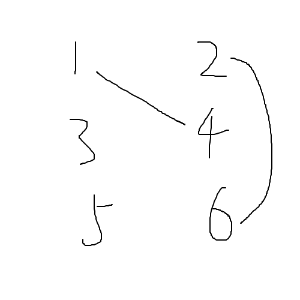
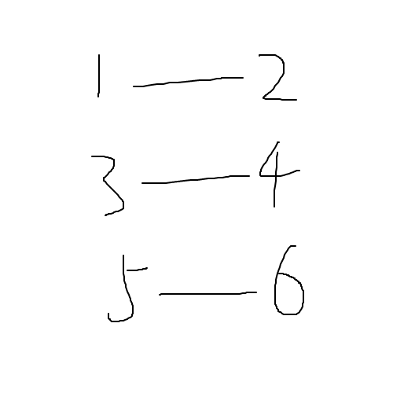
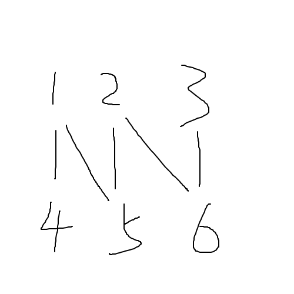

# 匈牙利算法

用来解决最大匹配问题的，时间复杂度$O(n*m)$。

定义匹配：
    
    图G的某个匹配是无公共点的边集合。

<div align=center>
    
    <p style="font-size:14px;color:#C0C0C0;text-decoration:underline">
        匹配
    </p>
</div>

如上图中两条边构成一个匹配，两边无公共点。

定义二分图：

    二分图是给定两组顶点，组内任意两顶点无边相连，只有不同组的顶点间有边相连的图。

<div align=center>
    
    <p style="font-size:14px;color:#C0C0C0;text-decoration:underline">
        二分图1
    </p>
</div>

上图就是一个二分图。

定义完美匹配：

    完美匹配是对二分图中每个顶点都有且仅有一个对应的顶点与它有边相连。

考虑这样一个配偶问题：

$n$个男与$n$个女，一个男可能对多个女有好感，一个女也可能对多个男有好感，如何使尽量多的人与自己有好感的人匹配？

这是求解“**最大匹配**”，注意**最大匹配不一定是完美匹配**。

给出另外三个定义：

    1. 路径是二分图的某些有公共点的边集合。

    2. 假设M是图G的一个匹配，那么M的交错路径指的是匹配边和非匹配边交替构成的路径。

    3. 假设M是图G的一个匹配，那么M的增广路径指的是“起点和终点都是M的非匹配边顶点”的M的交错路径。

<div align=center>
    
    <p style="font-size:14px;color:#C0C0C0;text-decoration:underline">
        二分图2
    </p>
</div>

上图中$1\rightarrow5$和$2\rightarrow6$显然是一个匹配，但是$1\rightarrow4$、$2\rightarrow5$和$3\rightarrow6$则是一个更大的匹配。

对于匹配$1\rightarrow5$和$2\rightarrow6$来说，路径$4\rightarrow1\rightarrow5\rightarrow2\rightarrow6\rightarrow3$是一个交错路径，而$1\rightarrow4$、$2\rightarrow5$和$3\rightarrow6$构成了一个增广路径。

这意味着，**对当前匹配每找到一个增广路径，就能增大匹配！**

匈牙利算法关键有一个返回bool值的dfs函数：

```c++
/*
    vis用于标记某一点是否被访问过
    lk（link）是与某右节点相连的左节点
    如果当前点尚未连接或者可以让出空位，函数返回1
*/
bool dfs(int u)
{
	for(auto v:e[u])
	{
		if(!vis[v]){
			vis[v]=1;
			if(match[v]==0||dfs(match[v]))
			{
				match[v]=u;
				rematch[u]=v;
				return 1;
			}
		}
	}
	return 0;
}
```

两个注意：

1. 主函数当中每次$dfs$之前都需要把$vis$清空为$0$
2. 这里只记录了单向$link$，实际上还可以记录一个反向$link$，令$rlk[u]=v$即可

匈牙利算法还可以用于二分图的判定，即某个无向图能否被染色成二分图（即相邻的两个点不同色，只能用两种颜色）：

```c++
/*
    颜色分为1和-1
    主函数中对每个点i执行dfs(i,1)
    如果返回0则不能构成二分图
    co（color）标记节点颜色
*/
bool dfs(int u,int c)
{
	co[u]=c;
	for(auto v:e[u])
	{
		if(co[v]==co[u]) return 0;
		if(co[v]==0&&!dfs(v,-c)) return 0;
	}
	return 1;
}
```

对每个点只需要判断1能否成立即可，因为算法中为了造出二分图，**可能会把所有点的颜色反转**。

# KM算法

给定一张二分图，每条边有边权，现在需要求出一组匹配使得边权总和最大。

注意：

    KM算法会先保证最大匹配，然后保证边权总和最大。
    只能用于求解带权最大匹配是完美匹配的情况。

定义顶点标记值：

>   左部节点标记值为$a_i$，右部节点标记值为$b_j$
    满足$a_i+b_j>=w(i,j)$，$w(i,j)$为顶点间边权，没有边相连时设为负无穷

定义相等子图：

>   二分图中所有两端节点顶点标记值和满足$a_i+b_j=w(i,j)$的边构成的子图称为相等子图

定理：

    如果某个相等子图是完美匹配，那么它就是带权最大匹配。

证明：

>   完美匹配的边权和为$\sum (a_i+b_j)$
>   由于对于任意的$i$、$j$而言，$a_i+b_j>=w(i,j)$，不管如何更改边，都不可能再找到大于当前匹配的新匹配。

算法原理：

>   考虑对当前匹配树当中所有顶点的标记值：假设令$a_i-\delta$，$b_j+\delta$，会发生什么呢？
>>  对于所有已匹配的点，$a_i+b_j$不发生变化
>>  对于所有未匹配的右部节点$j'$，$a_i+b_{j'}$减小，$j'$更有可能被匹配了
>
>   所以只要找出$\delta$即可。
>   算法令$\delta$为当前匹配树中最小的$a_i+b_j-w(i,j)$的值用于扩大匹配。

代码如下：

```c++
bool dfs(int x)
{
	va[x]=1;
	for(int y=1;y<=n;++y)
	{
		if(!vb[y]){
			if(la[x]+lb[y]==mp[x][y])
			{
				vb[y]=1;
				if(!match[y]||dfs(match[y]))
				{
					match[y]=x;
					return 1;
				}
			}
			else
				delta=min(delta,la[x]+lb[y]-mp[x][y]);
		}
	}
	return 0;
}

int km()
{
	for(int i=1;i<=n;++i)
	{
		match[i]=0;
		la[i]=-inf;
		lb[i]=0;
		for(int j=1;j<=n;++j)
		{
			la[i]=max(la[i],mp[i][j]);
		}
	}
	for(int i=1;i<=n;++i)
	{
		while(1)
		{
			memset(va,0,sizeof(va));
			memset(vb,0,sizeof(vb));
			delta=inf;
			if(dfs(i)) break;
			for(int j=1;j<=n;++j)
			{
				if(va[j]) la[j]-=delta;
				if(vb[j]) lb[j]+=delta;
			}
		}
	}
	int ans=0;
	for(int i=1;i<=n;++i)
		ans+=mp[match[i]][i];
	return ans;
}
```