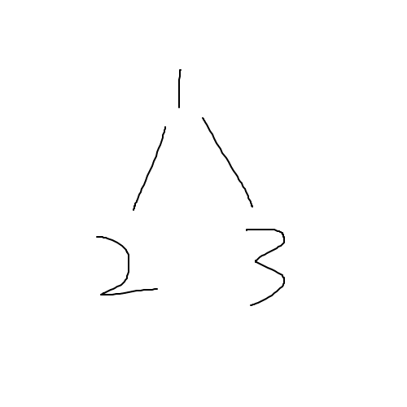
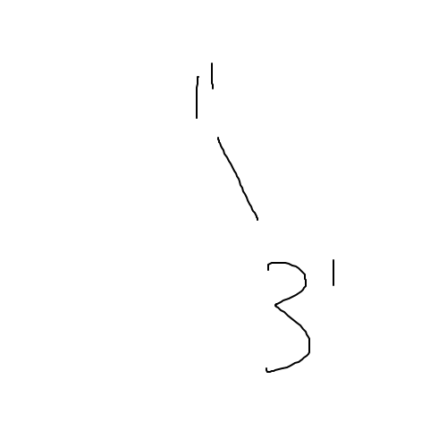
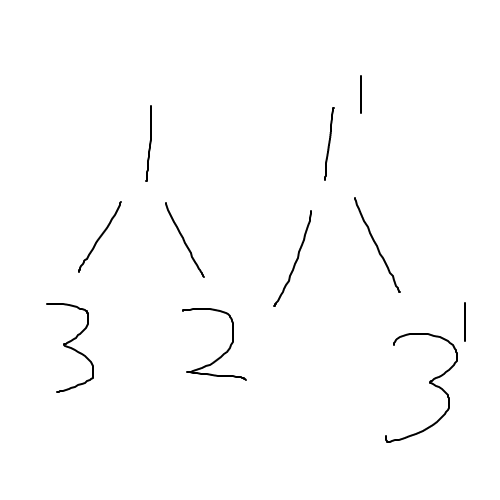

一种“可持久化”的线段树，可以记录某个历史版本对应的值。

假设现在有一棵树如下图这样：

<div align=center>
    
    <p style="font-size:14px;color:#C0C0C0;text-decoration:underline">
        第一步
    </p>
</div>

假设现在要修改$3$节点对应的区间，那么先复制出一个根$1'$，再复制一个修改过的$3'$，连接成下图这样：

<div align=center>
    
    <p style="font-size:14px;color:#C0C0C0;text-decoration:underline">
        第二步
    </p>
</div>

最后一步，把那些没修改的节点跟新建的根连接起来像下图这样：

<div align=center>
    
    <p style="font-size:14px;color:#C0C0C0;text-decoration:underline">
        第三步
    </p>
</div>

这样只需要**记录某个历史版本对应的根就可以访问这个版本的全部值了**，每次修改时间复杂度$O(log(n))$。

为了查询静态区间第$k$大，需要在值域上建立主席树，每次插入一个数就新开一个历史版本。

如果需要查询$[L,R]$区间的第k大，只需要考虑$[L-1,R]$区间中哪些数字被加了一即可，类似于前缀和。

静态区间第$k$大的模板如下：

```c++
int n,m,l,r,k;
int a[maxn],tmp[maxn],org[maxn],tot=0;
int rt[maxn];// 储存根的编号
struct node {
// 主席树结构体，ll和rr分别代表左右儿子，cnt记录区间和，每次更改必须要传入参数l和r，代表该节点表示的区间
    int ll,rr,cnt;
}tr[maxn*300];

int build(int l,int r) {// 建立空主席树，动态开点，返回根节点编号
    int p=++tot;
    tr[p].cnt=0;
    if(l==r) return p;
    int m=l+r>>1;
    tr[p].ll=build(l,m);
    tr[p].rr=build(m+1,r);// 连接左右儿子
    return p;
}

int change(int rt,int l,int r,int x,int y) {// 更改区间的值
    int p=++tot;
    tr[p]=tr[rt];
    if(l==r){
        tr[p].cnt++;
        return p;
    }
    int m=l+r>>1;
    if(y<=m) tr[p].ll=change(tr[rt].ll,l,m,x,y);
    else tr[p].rr=change(tr[rt].rr,m+1,r,x,y);
    // 因为每次更新只涉及到一个点，所以只向着一边重建，跟x没什么关系，这样写是为了区间修改的操作
    tr[p].cnt=tr[tr[p].ll].cnt+tr[tr[p].rr].cnt;// 向上更新
    return p;
}

int ask(int p,int q,int l,int r,int k) {// 询问函数
    int sum=tr[tr[q].ll].cnt-tr[tr[p].ll].cnt;
    int m=l+r>>1;
    if(l==r) return l;// 得到答案
    if(sum>=k) return ask(tr[p].ll,tr[q].ll,l,m,k);// 左区间数字个数多于k
    else return ask(tr[p].rr,tr[q].rr,m+1,r,k-sum);// 左区间数字个数少于k
}

int main() {// 主函数
    scanf("%d%d",&n,&m);
    rt[0]=build(1,n);// 获得第一版根
    for(int i=1;i<=n;++i) {
        scanf("%d",&a[i]);
        tmp[i]=a[i];
    }
    sort(tmp+1,tmp+1+n);
    for(int i=1;i<=n;++i) {
        int k=lower_bound(tmp+1,tmp+1+n,a[i])-tmp;
        org[k]=a[i],a[i]=k;
    }
    // 离散化
    for(int i=1;i<=n;++i)
        rt[i]=change(rt[i-1],1,n,1,a[i]);// 在上一版根的基础上插入新值，注意那个1,a[i]只是做做样子，真正起作用的是a[i]
    for(int i=1;i<=m;++i) {
        scanf("%d%d%d",&l,&r,&k);
        printf("%d\n",org[ask(rt[l-1],rt[r],1,n,k)]);// 询问对应区间的第k大
    }
    return 0;
}
```