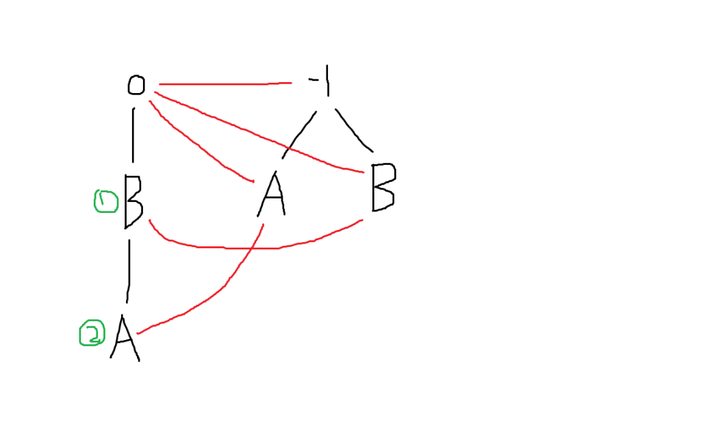

对于串“ABBA”，建立出来的回文自动机如下图：

<div align=center>
    
    <p style="font-size:14px;color:#C0C0C0;text-decoration:underline">
        回文自动机
    </p>
</div>

有一些说明：

1. 上图中黑线表示后缀边，红线表示$fail$边
2. **每个节点都代表了一个回文子串**，例如图中①号节点代表了$BB$，②号节点代表了$ABBA$
3. 一个回文自动机**实际上包含两棵树，分别代表奇偶回文子串**
4. **每条后缀边上都有一个字符**，若某点对应的回文子串为$S$，后缀边上的字符为$c$，那么这条后缀边指向了代表$c+S+c$这个回文串的节点
5. **把奇数回文子串的初始长度设为$-1$就是为了满足后缀边的特性**

模板如下：

```c++
/*
    fail[x]：x节点失配之后跳转到不等于自身的最长后缀回文子串
    len[x]：以x结尾的最长回文子串长度
    num[x]： 与”以x结尾的最长回文子串“本质不同的子串个数
    cnt[x]：与”以x结尾的最长回文子串“本质相同的子串个数
    （注意上面两个数组完全相反）
    son[x][c]：编号为x的节点表示的回文子串在两边添加字符c之后变成的回文子串编号
    s[x]：第x次添加的字符，s数组即原字符串
    tot：总节点个数，节点编号由0到tot-1
    last：最后一个新建立节点的编号
    cur：当前节点在PAM上的父亲编号
*/
struct PAM
{
	int tot,last,n,cur;
	int fail[N],len[N],same[N],diff[N],son[N][26];
	char s[N];
	int get(int p,int x)
	{
		while(s[x-len[p]-1]!=s[x])
			p=fail[p];
		return p;
	}
	int newnode(int x)
	{
		len[tot]=x;
		return tot++;
	}
	void build()
	{
		scanf("%s",s+1);
		s[0]=-1,fail[0]=1,last=0;
		newnode(0),newnode(-1);
		for(n=1;s[n];++n)
		{
			s[n]-='a';
			cur=get(last,n);
			if(!son[cur][s[n]])
			{
				int now=newnode(len[cur]+2);
				fail[now]=son[get(fail[cur],n)][s[n]];
				diff[now]=diff[fail[diff[now]]]+1;
				son[cur][s[n]]=now;
			}
			same[last=son[cur][s[n]]]++;
		}
		for(int i=tot-1;i>=0;--i)
			same[fail[i]]+=same[i];
	}
}pam;
```