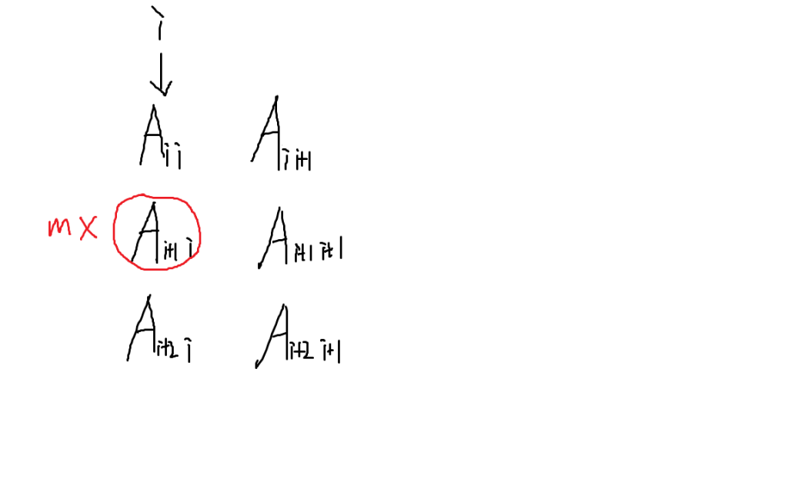
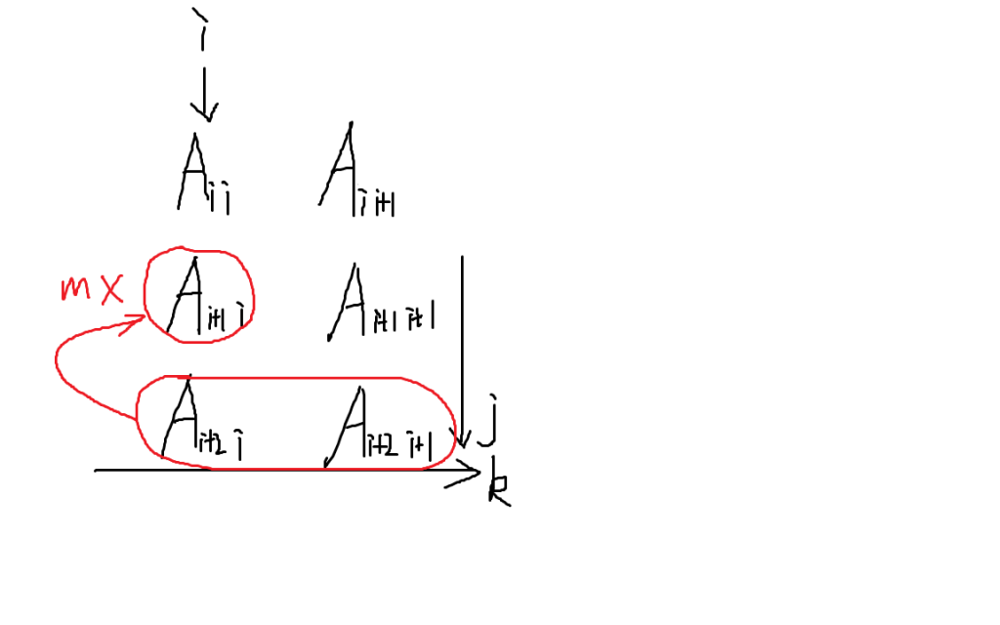

用来解线性方程组的算法。

每次选取一列，即对应的一个未知变量，把关于这个未知变量最大的系数放到第一行去，以达到消元时减小精度误差的目的，之后回代求解。

复杂度$O(n^3)$。

基本步骤如下：

首先我们找到当前列中最大系数的位置，假设为$mx$，并且交换$mx$与$a[i][i]$。

<div align=center>
    
    <p style="font-size:14px;color:#C0C0C0;text-decoration:underline">
        第一步
    </p>
</div>

随后对每个含有$i$对应的未知元的方程使用加减消元公式：

$$a[j][k]-=a[i][k]*a[j][i]/a[i][i]$$

就像用下图中的下一行减去上一行：

<div align=center>
    
    <p style="font-size:14px;color:#C0C0C0;text-decoration:underline">
        第二步
    </p>
</div>

模板如下：

```c++
/*
    a数组是由n*n的系数矩阵和一列常数构成，第n+1列是常数
    No Solution表示方程组没有唯一解
    gauss消元是会丢精度的，要注意调整eps的取值
*/
void gauss(db a[10005][10005]) {
    for(int i=1;i<=n;++i) {        
        int mx=i;
        for(int j=i+1;j<=n;++j)
            if(fabs(a[j][i])>fabs(a[mx][i]))
                mx=j;
        if(fabs(a[i][i])<eps) {//the maxium value is 0.0
            puts("No Solution");
            return;
        }
        if(mx!=i) {
            for(int j=1;j<=n+1;++j)
                swap(a[i][j],a[mx][j]);
        }
        for(int j=1;j<=n;++j) {
            if(j!=i) {
                db tmp=a[j][i]/a[i][i];
                for(int k=i+1;k<=n+1;++k)
                    a[j][k]-=a[i][k]*tmp;
            }
        }
    }
    for(int i=1;i<=n;++i)
        printf("%.2lf\n",a[i][n+1]/a[i][i]);
}
```

关于解的存在性的结论如下：

1. 若存在系数全0常数不为0的行，无解
2. 若系数不全为0的行恰好有n个，有唯一解
3. 若系数不全为0的行数k小于n，则说明一共有k个主元，n-k个自由元，有无穷多解

高斯消元还有一种特别的版本——异或方程组，题目见[P2962 [USACO09NOV]灯Lights](https://www.luogu.com.cn/problem/P2962)。

题解地址：[题解](https://www.cnblogs.com/oneman233/p/11534636.html)。

模板如下：

```c++
/*
    gauss函数返回的是方程组是否有自由元
    异或方程组有2^(自由元个数)个解
*/
bool gauss(int a[maxn][maxn]) {
    bool no=1;
    for(int i=1;i<=n;++i) {
        int mx=i;
        while(mx<=n&&!a[mx][i]) ++mx;
        if(mx>n) {
            no=0;
            continue;
        }
        swap(a[i],a[mx]);
        for(int j=1;j<=n;++j) {
            if(i==j||!a[j][i]) continue;
            for(int k=i+1;k<=n+1;++k)
                a[j][k]^=a[i][k];
            a[j][i]=0;
        }
    }
    return no;
 }
```