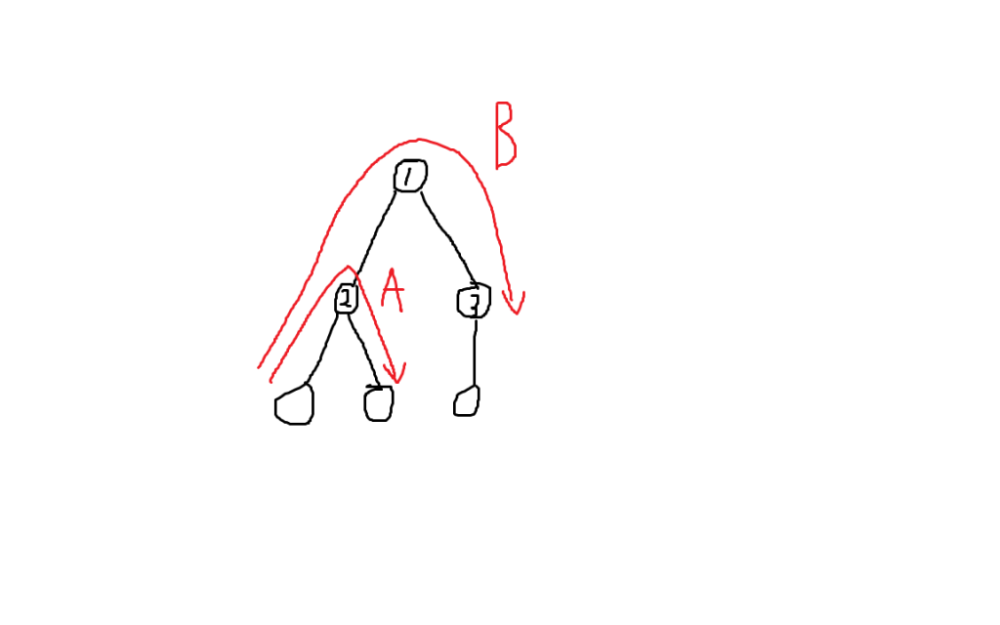

考虑这样一个问题：

    给定一棵有n个点的树，询问树上距离为k的点对是否存在。 

朴素的想法是用$O(n^2)$时间枚举点对，然后在$O(log(n))$时间内利用$LCA$找到两点间距离，看是否为$k$即可，但是在$n$较大的情况下必然不可行。

考虑树上的所有路径本质上只有两类，如下图：

<div align=center>
    
    <p style="font-size:14px;color:#C0C0C0;text-decoration:underline">
        树上路径
    </p>
</div>

假设目前以①号节点为根，那么$A$类路径代表①号节点某个子树中的路径，$B$类路径则代表经过①号节点的路径。

可以发现**如果能在$O(n)$时间内解决$B$类路径的计数问题，那么就可以利用分治的思想，控制遍历层数在$O(log(n))$，递归地对每个①号节点的子树求解$B$类路径**。

这样就把所有的路径归一成了不同子树上$B$类路径的求解，这也是点分治的基础。

点分治首先考虑不同子树对当前根的影响，然后递归计算下去，基本步骤如下：

1. 找到**树的重心**，维持树深在$O(log(n))$附近
2. 求出每个点到当前根的距离以及这个点属于哪颗子树
3. 执行$cal$函数，计算答案贡献
4. 删除当前节点，对子树进行递归

不同的题目的cal函数大相径庭，下面贴上 [P3806 【模板】点分治1](https://www.luogu.org/problem/P3806) 的代码：

```c++
/*
    getrt：获取树的重心
    getdis：获取距离
    cal：计算答案贡献
    div：分治函数
*/
#include <bits/stdc++.h>
using namespace std;
const int maxn=500005;
const int inf=0x3f3f3f3f;

int n,m,a,b,c,ask[maxn];
bool have[maxn*20],can[maxn],vis[maxn];
vector<int> g[maxn],v[maxn];
int sum,sz[maxn],son[maxn],rt;
int rem[maxn],dis[maxn];
queue<int> q;

void getrt(int x,int f){
    sz[x]=1,son[x]=0;
    for(int i=0;i<g[x].size();++i){
        int y=g[x][i];
        if(vis[y]||y==f) continue;
        getrt(y,x);
        sz[x]+=sz[y];
        son[x]=max(son[x],sz[y]);
    }
    son[x]=max(son[x],sum-sz[x]);
    if(son[x]<son[rt]) rt=x;
}

void getdis(int x,int f){
    rem[++rem[0]]=dis[x];
    for(int i=0;i<g[x].size();++i){
        int y=g[x][i];
        if(vis[y]||y==f) continue;
        dis[y]=dis[x]+v[x][i];
        getdis(y,x);
    }
}

void cal(int x){
    dis[x]=0;
    for(int i=0;i<g[x].size();++i){
        int y=g[x][i];
        if(vis[y]) continue;
        rem[0]=0;//clear the rem every time
        dis[y]=v[x][i];
        getdis(y,x);
        for(int i=rem[0];i;--i){
            for(int j=1;j<=m;++j){
                if(can[j]) continue;
                if(ask[j]>=rem[i])
                    can[j]|=have[ask[j]-rem[i]];
            }
        }
        for(int i=rem[0];i;--i){
            have[rem[i]]=1;
            q.push(rem[i]);
        }
    }
    while(!q.empty()){
        int f=q.front();
        have[f]=0;
        q.pop();
    }
}

void div(int x){
    vis[x]=1,have[0]=1;
    cal(x);
    for(int i=0;i<g[x].size();++i){
        int y=g[x][i];
        if(vis[y]) continue;
        sum=sz[y];
        rt=0;
        son[rt]=inf;
        getrt(y,0);
        div(rt);
    }
}

int main(){
    scanf("%d%d",&n,&m);
    for(int i=1;i<=n-1;++i){
        scanf("%d%d%d",&a,&b,&c);
        g[a].push_back(b);
        g[b].push_back(a);
        v[a].push_back(c);
        v[b].push_back(c);
    }
    for(int i=1;i<=m;++i) scanf("%d",&ask[i]);
    sum=n;
    rt=0;
    son[rt]=inf;
    getrt(1,0);
    div(rt);
    for(int i=1;i<=m;++i){
        if(can[i]) puts("AYE");
        else puts("NAY");
    }
    return 0;
}
```

点分治的清空操作真的是很恶心，**一定要记得清空$bool$数组以及更改当前子树中点的数量**。