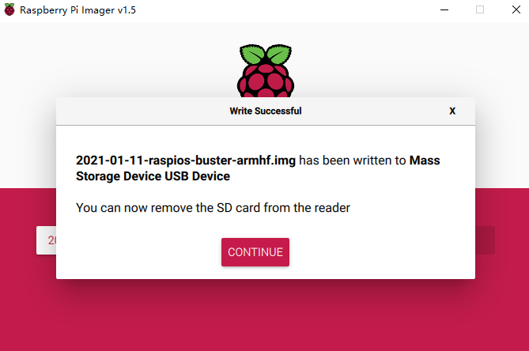
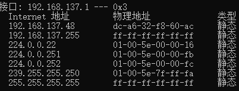
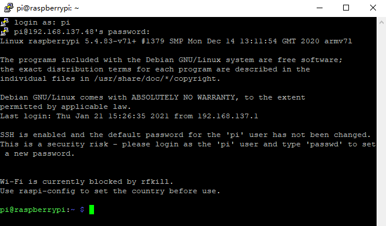
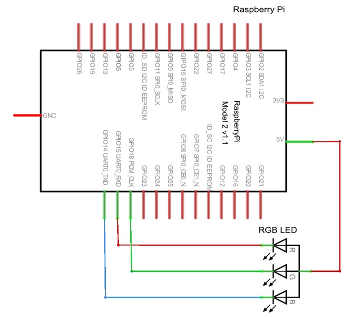

# 设备

淘宝卖家：[开源硬件商城](https://shop105705408.taobao.com/?spm=a230r.7195193.1997079397.2.6f603fffiBTXYd)，购置了树莓派4B 4GB，乌金甲外壳套餐，详细清单如下：

* 树莓派4B主板
* 树莓派4代电源 5V 3A TYPE-C接口（电源自带开关，避免多次插拔损伤树莓派电源接口）
* 闪迪16G TF卡
* 川宇读卡器

最后实付款是449元，快递送到的时候几乎没有损坏，非常满意。卖家也附送了安装教程，不过我有一些部分跟卖家的教程有些出入，所以做了这篇笔记。

# 散热外壳安装

卖家送了四个散热贴片，我分别在CPU和内存上贴了一个，然后把乌金甲合上拧上螺丝即可，卖家也送了拧螺丝的工具。

安装风扇的流程一样，每个风扇四角各有一个螺丝，共8个，我拧上之后才发现乌金甲螺丝和风扇螺丝的螺帽大小不一样，不过都很牢靠就没有再交换它们。

树莓派上电后把风扇的接口插到树莓派的GPIO上即可让风扇开始工作。

# 安装OS

树莓派安装OS需要提前在SD卡中写好系统，然后再插入树莓派的SD卡插槽，注意：SD卡插槽在树莓派背面。

* [树莓派操作系统下载](https://www.raspberrypi.org/software/operating-systems/)
* [树莓派镜像安装软件](https://www.raspberrypi.org/software/)
* [镜像安装教程](https://www.youtube.com/watch?v=J024soVgEeM)

我选择了最新版本：Raspberry Pi OS with desktop(January 11th 2021)，带有图形界面，Lite版本不带图形界面，也可以选择带有recommended software的版本，不过我觉得太占空间就没有选择它。

总共1.1GB的数据，下载比较慢，也可以试试用官网提供的种子下载，我感觉直接下载和种子下载速度差不多。写入和验证OS的操作也比较费时，大概要五六分钟左右，最后会给你提示：

<div align=center>
    
    <p style="font-size:14px;color:#C0C0C0;text-decoration:underline">
        这时拔出SD卡即可
    </p>
</div>

# 开机

教程中有一节在headless条件下远程连接树莓派，没有任何I/O设备，主要步骤如下：

## 开启ssh

把SD卡用读卡器连接到PC，在SD卡盘符下新建"ssh"文件（无后缀）即可。

注意：**树莓派在启动之后会自动删除这个ssh文件，但是此时实际上ssh功能已经打开，直接尝试连接即可。**

## 使用ssh登录树莓派


我在尝试SSH连接时只有网线、笔记本电脑和wifi，配置时甚至懒得摆弄路由器，也成功用ssh方式连接了树莓派，基本步骤如下：

### 准备工作

先给树莓派上电，正常运行时红灯常亮，绿灯闪烁，如果不正常可以查阅[这份文档](https://shumeipai.nxez.com/2014/09/30/raspberry-pi-led-status-detail.html)。

这里踩了个坑，树莓派开机时绿灯正常闪烁，之后突然熄灭，这种情况下不必担心，**OS没有操作时绿灯确实会自然熄灭**。如果最后发现OS确实无法启动，可能是树莓派本身有问题，执行以下检查：断电后将SD卡拔出来，然后插电，看到绿灯常亮，说明板子的EEPROM是OK的。

然后下载[PuTTY](https://www.chiark.greenend.org.uk/~sgtatham/putty/latest.html)，用来做ssh连接。

### 给树莓派通网

由于我懒得摆弄路由器，我直接找了根网线把树莓派和笔记本电脑连到了一起。

之后在笔记本电脑上勾选以下项：设置-WLAN-网络和共享中心-WLAN-属性-共享-允许其他用户通过此计算机的 Internet 连接来连接，下拉选项选择”以太网“。

> 这里请注意，如果下次你发现无法连接自己的树莓派，那可能是因为你的树莓派是Public IP，你应当关闭这个设置再尝试连接，关闭后树莓派将会是Local IP。

之后在网络和共享中心单击刚刚连接的以太网，不久后它应该就会有发送和接收数据了，再查看详细信息，记录下此时的IPv4地址，我这里是：192.168.137.1

打开cmd，执行`arp -a`，找到刚才那个IPv4接口下的 Internet 地址，如下图：

<div align=center>
    
    <p style="font-size:14px;color:#C0C0C0;text-decoration:underline">
        注意物理地址
    </p>
</div>

树莓派的物理地址不会那么整齐，显然上图中第一个 Internet 地址就是我们的树莓派IP了。

### 连接树莓派

打开PuTTY，输入上面的IP地址，OS的默认用户名是`pi`，密码是`raspberry`（密码不会显示）。

注意：**默认密码与所安装的操作系统有关。**

之后就可以成功登陆了：

<div align=center>
    
    <p style="font-size:14px;color:#C0C0C0;text-decoration:underline">
        大功告成
    </p>
</div>

## 远程桌面连接

主要有树莓派和笔记本两方面的设置：

### 安装VNC Server

键入以下命令：

```
$sudo apt-get install tightvncserver
$tightvncserver :1
```

安装时有一个地方选择`y`即可，注意以上命令代表着在 1 号端口打开了VNC Server。打开端口时会要求你设置连接密码，并且会询问你：是否需要设置一个访客密码，我因为用不到所以就选择`n`。

> 注意下次需要使用远程桌面连接时仍然需要键入第二条命令来开启VNC服务器。

### 安装VNC Viewer

[下载地址](https://www.realvnc.com/en/connect/download/viewer/windows/)，在左上角`File`里选择`New connection...`：`VNC Server`栏输入`树莓派的IP地址:1`，这里的 1 就是刚才配置的端口号；`Name`随便取，做标识用的。

之后会要求你输入密码，就是刚才配置的连接密码，之后即可进入桌面。

## 上传文件

使用psftp完成，它是随PuTTY一起下载的一个远程文件传输工具，放在与PuTTY相同的目录下。

注意：**psftp对应的本地目录是psftp所在的目录**，所以你需要把它移动到与需要上传的文件同一目录下再进行启动。

几个常用命令：
1. `lpwd`：查看psftp当前所在的本地目录
2. `open xxx.xxx.xxx.xxx`：连接对应IP
3. `put "test file.txt"`：上传文件（**文件名中有空格时必须使用双引号**）
4. `get "text file.txt"`：下载文件
5. `cd`：移动远程目录
6. `ls`：显示远程目录下的所有文件

# 启动配置

首次进入树莓派有以下三个主要步骤：

1. 选择时区
2. 修改默认管理员密码
3. 连接Wifi，安装语言，检查更新

之后树莓派会重启，用PuTTY打开服务器端口，再重新连接VNC即可，初始桌面如下图所示：

<div align=center>
    
    <p style="font-size:14px;color:#C0C0C0;text-decoration:underline">
        树莓派的默认界面
    </p>
</div>

# 第一次的GPIO

首先来看看树莓派的引脚图：

<div align=center>
    
</div>

注意BCM编码和wiringPi编码的区别，不同的程序在实际使用中可能使用不同的编码。下面两个外设中使用的主要是BCM编码，做了LED的显示和温度传感器：

## LED灯

LED灯有四个接口，分别对应RGB三个量和一个接地（**注意也有的LED灯是接5v**），接5v的LED灯的硬件原理图如下：

<div align=center>
    
</div>

基本步骤如下：

1. 找到RGB对应的BCM端口编码，建立相应变量。
2. 设置为BCM模式，并且设置为GPIO输出。
3. 树莓派自带有PWM脉宽调制功能，通过`ChangeDutyCycle()`函数可以改变占空比来达到显示不同颜色的目的。
4. 可以利用Python的time库来让系统休眠一段时间，达到颜色持续显示的目的。

接地的LED灯的Python代码如下：

```py
import RPi.GPIO
import time
 
R, G, B = 15, 18, 14
 
RPi.GPIO.setmode(RPi.GPIO.BCM)
 
RPi.GPIO.setup(R, RPi.GPIO.OUT)
RPi.GPIO.setup(G, RPi.GPIO.OUT)
RPi.GPIO.setup(B, RPi.GPIO.OUT)
 
pwmR = RPi.GPIO.PWM(R, 70)
pwmG = RPi.GPIO.PWM(G, 70)
pwmB = RPi.GPIO.PWM(B, 70)
 
pwmR.start(0)
pwmG.start(0)
pwmB.start(0)
 
try:
 
    t = 0.5
    while True:
        # 红色灯全亮，蓝灯，绿灯全暗（红色）
        pwmR.ChangeDutyCycle(100)
        pwmG.ChangeDutyCycle(0)
        pwmB.ChangeDutyCycle(0)
        time.sleep(t)
         
        # 绿色灯全亮，红灯，蓝灯全暗（绿色）
        pwmR.ChangeDutyCycle(0)
        pwmG.ChangeDutyCycle(100)
        pwmB.ChangeDutyCycle(0)
        time.sleep(t)
         
        # 蓝色灯全亮，红灯，绿灯全暗（蓝色）
        pwmR.ChangeDutyCycle(0)
        pwmG.ChangeDutyCycle(0)
        pwmB.ChangeDutyCycle(100)
        time.sleep(t)
 
except KeyboardInterrupt:
    pass
 
pwmR.stop()
pwmG.stop()
pwmB.stop()
 
RPi.GPIO.cleanup()
```

这里要注意接地的和接5v的LED灯的区别：**二者显示的颜色可能是反的**。这意味着接地的LED灯显示红色的时候，同样的代码可能使接5v的LED灯显示蓝色绿色混合。

## 温度传感器

传感器选用的是DS18B20温度传感器模块，不需要自己接电阻，使用很方便。负极接地，中间的接口接3.3v电源，剩下s端是信号端，接一个GPIO口就行。我接的是GPIO.7口，对应的BCM编码是4。

首先要修改树莓派的配置，使用以下命令：

```
sudo nano /boot/config.txt
```

在最后一行添加：

```
dtoverlay=w1-gpio,gpiopin=4
```

之后重启树莓派，关于config文件的更多设置可以参考树莓派本身的使用指南：`/boot/overlay/readme`

接下来确认传感器是否生效，键入以下命令：

```
sudo modprobe w1-gpio
sudo modprobe w1-therm
cd /sys/bus/w1/devices/
ls
```

传感器运行正常的话应该会获得以下结果：

```
28-00000494cb79 w1_bus_master1
```

28开头的一串字符就是外接传感器的目录，所有获取的数据都存放在这个目录下的`w1_slave`文件中，接下来使用以下命令：

```
cd 28-00000494cb79
cat w1_slave
```

可以得到当前温度的输出：

```
70 01 4b 46 7f ff 10 10 e1 : crc=e1 YES
70 01 4b 46 7f ff 10 10 e1 t=23000
```

第一行输出YES代表温度读取正常，第二行的t就是当前的温度值，**单位摄氏度**，此外还需要需要我们**除以1000来获取小数点后三位**的结果，此时的温度就是23摄氏度。

接下来使用Python来直接从文件中获取结果，代码如下：

```py
#打开温度传感器文件
tfile = open("/sys/bus/w1/devices/28-00000494cb79/w1_slave")
#读取文件所有内容
text = tfile.read()
#关闭文件
tfile.close()
#用换行符分割字符串成数组，并取第二行
secondline = text.split("\n")[1]
#用空格分割字符串成数组，并取最后一个，即t=23000
temperaturedata = secondline.split(" ")[9]
#取t=后面的数值，并转换为浮点型
temperature = float(temperaturedata[2:])
#转换单位为摄氏度
temperature = temperature / 1000
#打印值
print(temperature)
```

之后就可以直接在命令行运行Python脚本来获取当前温度了：

```
python /home/pi/temperature.py
```

LED灯和传感器连接后实物图如下：

<div align=center>
    
</div>