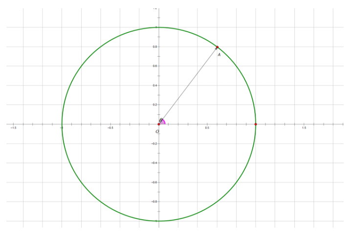
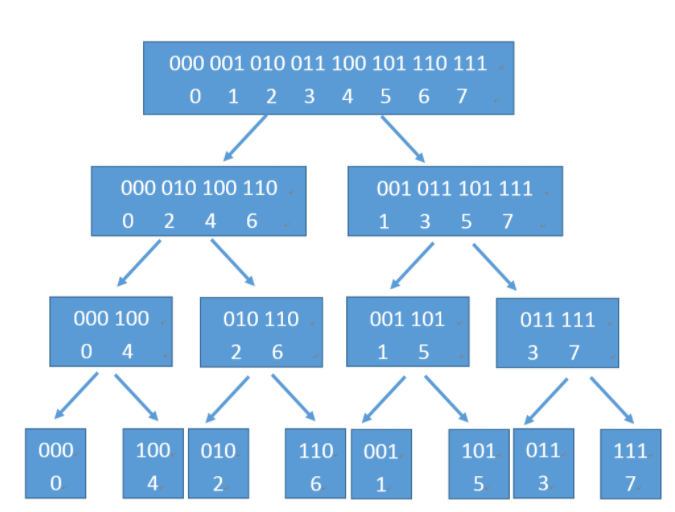

# 引入

考虑$n-1$次多项式$A(x)=a_0+a_1x+...+a_{n-1}x^{n-1}$和$m-1$次多项式$B(x)=b_0+b_1x+...+b_{m-1}x^{m-1}$，可以分别表示为$n$维向量$(a_0,a_1,...,a_{n-1})$和$m$维向量$(b_0,b_1,...,b_{m-1})$

它们相乘获得的多项式$C(x)$的次数显然为$n+m-2$，可以表示为一个$n-m+1$维的向量

朴素的算法如下：

```c++
memset(C,0,sizeof(C));
for(int i=0;i<n;++i)
    for(int j=0;j<m;++j)
        C[i+j]+=A[i]*B[j];
```

时间复杂度显然是$O(n^2)$，并不那么优秀

# 多项式的表示

实际上多项式有两种表示方法，**系数表达法**和**点值表达法**

## 系数表达法

一个$n-1$次的多项式的所有系数唯一确定了这个多项式：

$$
A(x)=a_0+a_1x+...+a_{n-1}x^{n-1}=\sum_{i=0}^{n-1}a_ix^i
$$

## 点值表达法

将一组互不相同的$(x_0,x_1,...,x_{n-1})$代入$A(x)$，得到$n$个取值：$(A(x_0),A(x_1),...,A(x_{n-1}))$，记为：$(y_0,y_1,...,y_{n-1})$

其中$x_i(i\in [0,n-1])$称为插值节点

定理：**一个$n-1$次多项式在$n$个不同点的取值唯一确定了该多项式**

证明：

> 假设定理不成立，即存在两个不同的$n-1$次多项式$A(x)$和$B(x)$，使得：$\forall i\in [0,n-1],A(x_i)=B(x_i)$
> 那么不妨令$C(x)=A(x)-B(x)$，此时有：$\forall i\in [0,n-1],C(x_i)=0$
> 显然$C(x)$是一个$n-1$次多项式，而它却有$n$个互不相同的根，这与代数基本定理矛盾
> 故原命题成立

如果按照定义求解多项式的点值表示，我们首先需要找到$n$个点，对每个点计算$n$次$a_ix^i$，时间复杂度为$O(n^2)$

## 多项式乘法

考虑$n-1$次多项式$A(x)$和$m-1$次多项式$B(x)$，他们的乘积$C(x)=A(x)*B(x)$

显然有：$C(x_0)=A(x_0)*B(x_0)$，并且$C(x)$是一个$n-m+2$次多项式

如果我们能找到$n-m+1$个插值节点并且代入计算，我们就能在$O(n+m)$的时间复杂度内获得$C(x)$

如果能快速完成系数表达和点值表达之间的互换，我们就能比$O(n^2)$更快地完成多项式乘法

# 复数

## 基本概念

形如$a+bi$这样的数叫做复数，$a$称为实部，$b$称为虚部，$i$称为虚数单位，满足：$i^2=-1$

特别的，当$a=0$时称为虚数，当$b=0$时称为实数

注意：$0$既是实数又是虚数

每一个复数$a+bi$都对应了一个平面向量$(a,b)$，这样的平面被称为复平面

复平面的$x$轴代表实部，称为实轴；$y$轴代表虚部，称为虚轴

复数$z=a+bi$的模长$\|z\|$定义为$z$在复平面上对应的平面向量的长度，即：$\|z\|=\sqrt{a^2+b^2}$

所以复数$z$又可以表示为$(\theta,\|z\|)$，其中$\theta$是实轴的正半轴逆时针旋转到$z$的角度，称为幅角

虚数不能比较大小，两个复数相等当且仅当实部和虚部都相等

运算法则：
1. 
$$
(a+bi)+(c+di)=(a+c)+(b+d)i
$$
2. 
$$
(a+bi)-(c+di)=(a-c)+(b-d)i
$$
3. 
$$
(a+bi)*(c+di)=ac+bci+bdi+bdi^2=(ac-bd)+(ad+cb)i
$$
4. 
$$
\frac{a+bi}{c+di}=\frac{(a+bi)*(c-di)}{(c+di)*(c-di)}=\frac{(ac+bd)+(bc-ad)i}{c^2+d^2}
$$

复数的**加法满足平行四边形法则**；**乘法满足幅角相加，模长相乘**

对于一个复数$z=a+bi$，称$z'=a-bi$为它的共轭复数，有以下两个性质：
1. $z*z'=a^2+b^2$
2. $\lVert z\rVert=\lVert z'\rVert$

## 单位根

定义复平面中的单位根$e^{i\theta}=cos\theta+i*sin\theta$

显然单位根的模长为：$sin^2\theta+cos^2\theta=1$

全体单位根构成复平面中的单位圆，如下图所示：

<div align=center>
    
    <p style="font-size:14px;color:#C0C0C0;text-decoration:underline">
        单位根示意图
    </p>
</div>

**以单位圆和实轴正半轴的交点作为第一个等分点**，把单位圆等分成$n$个部分

以原点为起点，圆的这$n$个等分点作为终点，可以做出$n$个向量

其中**幅角为正且幅角最小**的向量称为$n$次单位向量，记为：$w_n^1$

上图中$\stackrel{\longrightarrow}{OA}$就是$8$次单位向量，即$w_8^1$

其余的$n-1$个向量记为：$w_n^2,w_n^3,...,w_n^n$，它们之间存在**递推关系**：$w_n^k=w_n^{k-1}*w_n^1(k\in [2,n])$

不难发现：$w_n^n=w_n^0=1$

实际上：$w_n^k=e^{2\pi*\cfrac{k}{n}i}=cos(2\pi*\cfrac{k}{n})+sin(2\pi*\cfrac{k}{n})*i$

单位根有两条重要性质：

### 折半引理

$$
w_{2n}^{2k}=w_n^k
$$

证明：

$$
\begin{aligned}
    &w_{2n}^{2k} \\
    =&cos(2\pi*\cfrac{2k}{2n})+sin(2\pi*\cfrac{2k}{2n})*i \\
    =&cos(2\pi*\cfrac{k}{n})+sin(2\pi*\cfrac{k}{n})*i \\
    =&w_n^k
\end{aligned}
$$

由此可以引申出：

$$
w_{mn}^{mk}=w_n^k
$$

### 消去引理

$$
w_n^{k+\cfrac{n}{2}}=-w_n^k
$$

证明：

$$
\begin{aligned}
    &w_n^{k+\cfrac{n}{2}} \\
    =&cos(2\pi*\cfrac{k+\cfrac{n}{2}}{n})+sin(2\pi*\cfrac{k+\cfrac{n}{2}}{n})*i \\
    =&cos(2\pi*\cfrac{k}{n}+\pi)+sin(2\pi*\cfrac{k}{n}+\pi)*i \\
    =&-cos(2\pi*\cfrac{k}{n})-sin(2\pi*\cfrac{k}{n})*i \\
    =&-w_n^k
\end{aligned}
$$

# 离散傅里叶变换

考虑一个$n-1$次的多项式$A(x)=a_0+a_1x+...+a_{n-1}*x^{n-1}$，保证$n=2^x-1,x\in N^+$

此时把$n$次单位根的$0,1,...,n-1$次幂，即：$w_n^0,w_n^1,...,w_n^{n-1}$，代入$A(x)$得到：$A(w_n^0),A(w_n^1),...,A(w_n^{n-1})$

这个过程称为**离散傅里叶变换（Discrete Fourier Transform）**

朴素$DFT$的复杂度也是$O(n^2)$，必须利用单位根的特殊性质来加速运算

对于：

$$
A(x)=a_0+a_1x+a_2x^2+a_3x^3+...+a_{n-2}x^{n-2}+a_{n-1}x^{n-1}
$$

转化成：

$$
A(x)=(a_0+a_2x^2+...+a_{n-2}x^{n-2})+x*(a_1+a_3x^2+...+a_{n-1}x^{n-2})
$$

令：

$$
\begin{aligned}
    A1(x)=a_0+a_2x+...+a_{n-2}x^{\frac{n-2}{2}} \\
    A2(x)=a_1+a_3x+...+a_{n-1}x^{\frac{n-2}{2}}
\end{aligned}
$$

不难发现：

$$
A(x)=A1(x^2)+x*A2(x^2)
$$

下面分两类进行讨论：

1. $k\in [0,\cfrac{n-2}{2}],k\in Z$

由折半引理可得：

$$
\begin{aligned}
    &A(w_n^k) \\
    =&A1(w_n^{2k})+w_n^k*A2(w_n^{2k}) \\
    =&A1(w_{n/2}^k)+w_n^k*A2(w_{n/2}^k)
\end{aligned}
$$

2. $k+\cfrac{n}{2}\in [\cfrac{n}{2},n-1],k\in Z$

由折半引理和消去引理可得：

$$
\begin{aligned}
    &A(w_n^{k+n/2}) \\
    =&A1(w_n^{2k+n})+w_n^{k+n/2}*A2(w_n^{2k+n}) \\
    \because & \ w_n^{2k+n}=w_n^{2k}*w_n^n=w_n^{2k}=w_{n/2}^k \\
    \therefore & \ A(w_n^{k+n/2})=A1(w_{n/2}^k)-w_n^k*A2(w_{n/2}^k)
\end{aligned}
$$

注意：上面两类讨论可以**保证$k$和$k+\cfrac{n}{2}$取遍了$[0,n-1]$中的$n$个整数**，也就保证了可以由这$n$个点值反推出多项式的系数表示，即：**该过程是可逆的**

同时，如果知道$A1(x)$和$A2(x)$在$w_{n/2}^0,w_{n/2}^1,...,w_{n/2}^{\frac{n-2}{2}}$处的取值，那就能在$O(n)$的时间内求出$A(x)$的取值，而$A1(x)$和$A2(x)$都是$A(x)$一半的规模，可以转化为子问题递归求解，其时间复杂度类似于归并排序：$O(nlogn)$

# 离散傅里叶反变换

将点值表示的多项式转化为系数表示的过程叫做**离散傅里叶反变换（Inverse Discrete Fourier Transform）**，上面提到过$DFT$是可逆的，$IDFT$就是它的逆过程

假设：$(d_0=A(w_n^0),d_1=A(w_n^1),...,d_{n-1}=A(w_n^{n-1}))$为$(a_0,a_1,..,a_{n-1})$经过$DFT$得到的结果

构造一个多项式：$F(x)=d_0+d_1x+...+d_{n-1}x^{n-1}$

设向量$(c_0,c_1,...,c_{n-1})$中的$c_k$是$F(x)$在$x=w_n^{-k}$处的点值表示，即：

$$
c_k=F(w_n^{-k})=\sum_{i=0}^{n-1}d_i*(w_n^{-k})^i
$$

考虑把$d_i=A(w_n^i)$代入上式：

$$
\begin{aligned}
    &c_k \\ 
    =&\sum_{i=0}^{n-1}(\sum_{j=0}^{n-1}a_j*(w_n^i)^j)*(w_n^{-k})^i \\
    =&\sum_{j=0}^{n-1}a_j*\sum_{i=0}^{n-1}(w_n^i)^j*(w_n^{-k})^i \\
    =&\sum_{j=0}^{n-1}a_j*\sum_{i=0}^{n-1}(w_n^i)^{j-k}
\end{aligned}
$$

令：

$$
S(j,k)=\sum_{i=0}^{n-1}(w_n^i)^{j-k}
$$

再令：

$$
\delta=j-k
$$

则：

$$
s(j,k)=w_n^0+w_n^\delta+...+w_n^{(n-1)\delta}
$$

不难看出$S(j,k)$实际上是一个等比数列的前$n$项和，公比为$w_n^\delta$，首项为$w_n^0=1$

下面分两类进行讨论：

1. $j-k=0$

此时显然有：$\delta=0,w_n^\delta=1$

得出：$S(j,k)=n$

2. $j-k \not = 0$

代入等比数列求和公式：

$$
S(j,k)=\cfrac{w_n^0*[(w_n^\delta)^n-1]}{w_n^\delta-1}=\cfrac{(w_n^n)^\delta-1}{w_n^\delta-1}=\cfrac{1-1}{w_n^\delta-1}=0
$$

所以得出结论：

$$
S(j,k)=[j==k]*n
$$

把上述结论代回$c_k$的表达式：

$$
\begin{aligned}
    &c_k \\
    =&\sum_{j=0}^{n-1}a_j*S(j,k) \\
    =&\sum_{j=0}^{n-1}a_j*[j==k]*n \\
    =&a_k*n
\end{aligned}
$$

再捋一捋他们的关系：

$$
a_k\stackrel{w_n^k}{\longrightarrow}d_k\stackrel{w_n^{-k}}{\longrightarrow}c_k
$$

**上式中每一个箭头就代表了一次$DFT$**

实际上，**对$DFT$得到的结果换一种插值再做一次$DFT$，就能起到$IDFT$的作用**，因为$a_k$和$c_k$之间有着密切的联系

注意：**$w_n^{-k}$是$w_n^k$的共轭复数**

# 在C中的实现

首先来看看$fft$向下递归时下标的变化情况：

<div align=center>
    
    <p style="font-size:14px;color:#C0C0C0;text-decoration:underline">
        下标变化
    </p>
</div>

所以可以先将原数组调整成最底层的位置，然后从倒数第二层由底向上迭代计算，这种算法被称为实现$fft$的$Cooley-Tukey$算法

最底层位置的数字遵循规律：**翻转了原顺序每个数字的二进制表示**

如下所示：

原顺序|原顺序二进制|最底层顺序|最底层顺序二进制
---|---|---|---
0|(000)|0|(000)
1|(001)|4|(100)
2|(010)|2|(010)
3|(011)|6|(110)
4|(100)|1|(001)
5|(101)|5|(101)
6|(110)|3|(011)
7|(111)|7|(111)

观察最底层顺序，实际上也是从$0$开始，用一种特殊的顺序得到的：**最高位加$1$，向低位进位**

用代码写出来就是把高位所有连续的的$1$置为$0$，并且把第一个$0$置为$1$：

```c
void getOrd(int n) {
	int i=0,j=0;
	for(;i<n;++i) {
		ord[i]=j;
		int mask=n/2;// highest position
		while(j&mask) j&=~mask,mask/=2;// change all 1 to 1
		j|=mask;// change 0 to 1
	}
}
```

现在考虑如何合并左右两部分答案：

假设当前层有$n$项需要处理，并且此时$A1(w_{n/2}^k)$和$A2(w_{n/2}^k)$分别存放在$a[k]$和$a[k+n/2]$当中

引入一个$buf$数组，我们希望把$A(w_n^k)$和$A(w_n^{k+n/2})$的结果分别存放在$buf[k]$和$buf[k+n/2]$当中

合并的操作可以表示为：

```c
buf[ k ] = a[ k ] + omega(n, k) * a[ k + n / 2 ];
buf[ k + n / 2 ] = a[ k ] - omega(n, k) * a[ k + n / 2 ];
```

不妨改变合并顺序，引入一个变量来实现原地更新：

```c
tmp = omega(n, k) * a[ k + n / 2 ];
a[ k + n / 2 ] = a[k] - tmp;
a[ k ] += tmp;
```

最后总的代码如下：

```c
#include <stdio.h>
#include <math.h>
#define PI acos(-1)
#define MAXN 5000005

/*
	Definition of Complex Number
*/

typedef struct{
	double r,i;
}Complex;
void setR(Complex *c,double r){c->r=r;}
void setI(Complex *c,double i){c->i=i;}
Complex initComplex(double r,double i){Complex c;setR(&c,r);setI(&c,i);return c;}
double getR(Complex c){return c.r;}
double getI(Complex c){return c.i;}
Complex add(Complex a,Complex b){return initComplex(a.r+b.r,a.i+b.i);}
Complex sub(Complex a,Complex b){return initComplex(a.r-b.r,a.i-b.i);}
Complex mul(Complex a,Complex b){return initComplex(a.r*b.r-a.i*b.i,a.r*b.i+a.i*b.r);}
Complex div(Complex a,double b){return initComplex(a.r/b,a.i/b);}
Complex coj(Complex a){return initComplex(a.r,-a.i);}
void swap(Complex *a,Complex *b){Complex c=*a;*a=*b;*b=c;}

/*
	Rader Sort
*/

int ord[MAXN];
void getOrd(int n) {
	int i=0,j=0;
	for(;i<n;++i) {
		ord[i]=j;
		int mask=n/2;// highest position
		while(j&mask) j&=~mask,mask/=2;// change all 1 to 1
		j|=mask;// change 0 to 1
	}
}

/*
	Cooley-Tukey
*/

void trans(Complex a[],int n,int flg) {// 1 for dft,-1 for idft
	// change the order
	int i=0;
	for(;i<n;++i)
		if(i<ord[i])
			swap(a+i,a+ord[i]);
	// from low to high
	int mid=1,L=0;
	for(;mid<n;mid*=2) {
		Complex ww=initComplex(cos(PI/mid),flg*sin(PI/mid)),tmp;
		for(L=0;L<n;L+=mid*2) {
			Complex w=initComplex(1.0,0.0);
			for(i=L;i<L+mid;++i,w=mul(w,ww))
				tmp=mul(w,a[i+mid]),
				a[i+mid]=sub(a[i],tmp),
				a[i]=add(a[i],tmp);
		}
	}
}

/*
	fft
*/

void dft(Complex a[],int n){trans(a,n,1);}
void idft(Complex a[],int n) {
	trans(a,n,-1);
	int i=0;
	for(;i<n;++i) a[i]=div(a[i],n);
}
```

实际操作中有两点需要特别注意：

## 精度调整

$double$强制转换成$int$会丢精度，最好加上$0.5$之后再转换

## 长度调整

上述$fft$模板仅用于数组长度为$2^x$的情况，具体情况具体调整

# C的swap函数

之前想用$C$写$swap$函数，大概像下面这样：

```c
void swap1(int *a,int *b) {
	int *c=a;
	a=b;
	b=c;
}
```

经过测试，完全不能交换$a$和$b$中储存的数字，必须写成下面这样：

```c
void swap2(int *a,int *b) {
	int c=*a;
	*a=*b;
	*b=c;
}
```

**单纯交换指针是不行的，应该交换指针指向的数字**

测试代码如下：

```c
#include <stdio.h>

void swap1(int *a,int *b) {
	int *c=a;
	a=b;
	b=c;
}

void swap2(int *a,int *b) {
	int c=*a;
	*a=*b;
	*b=c;
}

int main() {
	int a=1,b=2;
	printf("%d %d\n",a,b);
	swap1(&a,&b);
	printf("%d %d\n",a,b);
	swap2(&a,&b);
	printf("%d %d\n",a,b);
}
```

# 测试题目

1. [P3803 【模板】多项式乘法（FFT）](https://www.luogu.com.cn/problem/P3803)
2. [P1919 【模板】A*B Problem升级版（FFT快速傅里叶）](https://www.luogu.com.cn/problem/P1919)

# 参考

1. [一小时学会快速傅里叶变换（Fast Fourier Transform）](https://zhuanlan.zhihu.com/p/31584464)
2. [FFT中的Rader位反转算法](https://blog.csdn.net/weixin_30681121/article/details/98816180?utm_medium=distribute.pc_relevant_t0.none-task-blog-BlogCommendFromMachineLearnPai2-1.edu_weight&depth_1-utm_source=distribute.pc_relevant_t0.none-task-blog-BlogCommendFromMachineLearnPai2-1.edu_weight)
3. [C语言利用指针在函数中交换两个数的思考](https://blog.csdn.net/qq_25417713/article/details/53677517)