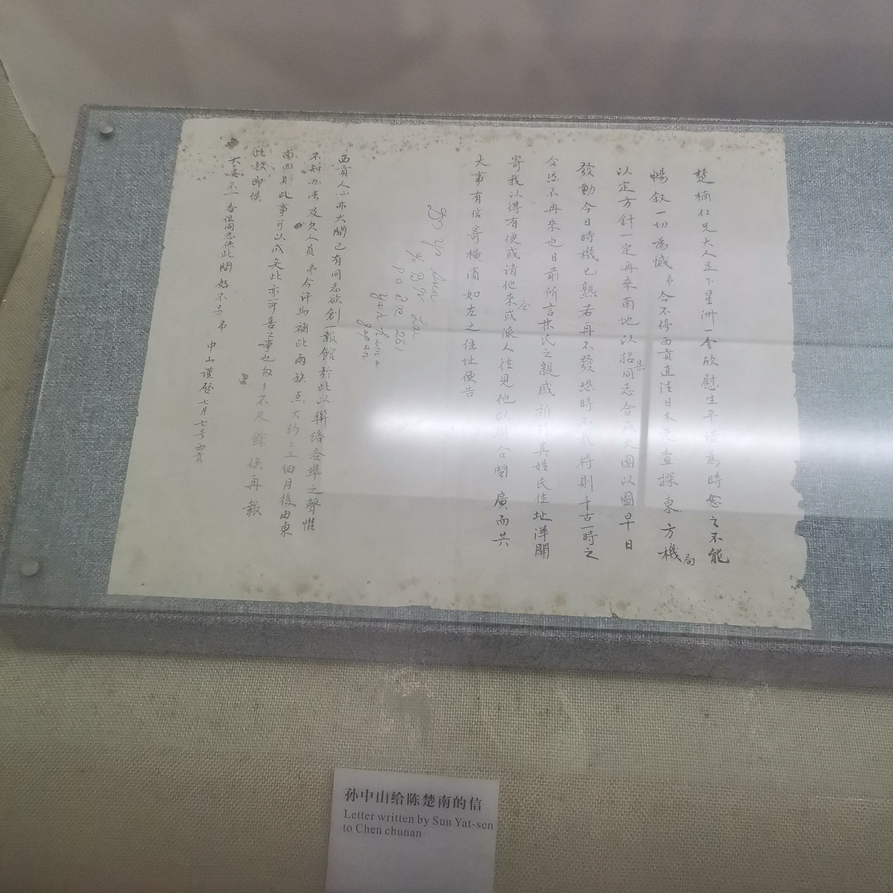

毕业旅行本来打算去朝鲜，但是听说那边对疫情管的很严，动不动就要枪毙人，于是作罢。思来想去，陆地风景实在是没什么看头，二十几年来最没少看的就是一望无际的山，于是决定去海边，首先去了离台湾最近的地方——厦门。

听说疫情没爆发的时候可以顺便从厦门去金门看看，那儿立着一面“三民主义统一中国”的墙，离厦门比离台湾岛近。疫情打乱了很多计划，我只能尽力不留下遗憾。

出发地是上海，选择了春秋航空提供的自由行，来回的机票和四晚酒店加在一块儿才1200，相当划算。难受的是春秋狭窄的座位和固定的机上推销环节，上机之前我身上只穿了一件衬衫，又没有免费的毛毯可用，只好抱紧背包尽量把身子蜷缩在一起。飞机刚落地，我终于没忍住晕机的痛苦，把晚饭一股脑吐了出来。

那件衬衫是我旅游前特地上淘宝买的，花花绿绿印满了夏威夷的蓝天白云沙滩和椰子树，充满夏日风情，所以厦门和北海的两趟旅游里我都穿着它。

高崎国际机场的热浪着实让我震惊，我们叫了一辆滴滴直奔旅馆，这时候晕机的难受劲已经烟消云散，我满脑子都想着能不能早点看到大海，顺便找点东西吃。我们定的民俗距离海边骑车只要十几分钟，但是厦门街上几乎没有共享单车，我们只好一路走到海边去，大概花了有三十分钟，但是抵达时我突然觉得不虚此行。

晚上十一点其实已经看不到什么海了，只能听见海潮隐约的声音，我们沿着海边捡了一大堆贝壳和鹅卵石，兴奋地难以言表。我从没见过绵延十数公里的免费开放的沙滩。

从沙滩回来后我们跑去吃沙茶面，就像下面这样：

    

我在这两趟旅游里做了一个非常明智的决定，把我吃的每一样东西都拍个照留作纪念，我也意识到旅游的最关键一环就是好好吃饭。

我的同行这时候看见街对面有一家蜜雪冰城，于是叫了一杯柠檬水来喝，这也导致他半夜闹肚子，吓得我们第二天赶紧去买了点胃药来。

厦门有一条完整的环岛路，柏油路面上时常有豪车风驰电掣，我们住的民俗附近的小路却显得有些凌乱，算是城中村样式。电瓶车旁若无人地四处穿行，两边的小贩买的最多的是烤生蚝和贝壳装饰品，还有一种包着虫子的果冻状的小吃，名字我给忘记了：

    

这东西的味道说不上好吃，但并不是难以下咽，总之可以称之为奇奇怪怪，但是不吃又觉得留下了点遗憾。

第二天一早起来我们昨晚吃沙茶面的那家小馆子里解决了早饭：

    

随后叫了滴滴去鼓浪屿，我出发前已经提前在网上订好了船票，所以逛的非常悠闲。坐船过去大概要二十分钟，回头望海岸时候恍惚间会觉得自己来到了新加坡：

    

遗憾的是逛了半天下来也没看着什么有意思的景点，岛上卖的小东西更是千篇一律——明信片、贝壳和鼓浪屿限定。其实这些你在淘宝上都能买到，但是总有人需要花点小钱买点回忆。我没那方面的需求，相对来说更加珍惜我的财产。不过好在岛上风景的确不错，有不少有意思的建筑，比如一个教堂：

    

还有一个小别墅：

    

不过这些热门景点的通病就是商业化程度过高，满大街没什么鸟语花香，倒是铜臭味扑面而来，一顿牛排午饭要价200往上，我跟我的同行硬是撑着饥饿离开岛之后才去吃午饭。

暑假那会儿的厦门天气更是折磨，走一公里就像蒸了半小时桑拿，我的同行不久就有了中暑的反应。岛上也没什么便利的交通工具，抱着探险的心情走到小岛深处的我们愣是硬生生用双脚走回了码头，途中自然也没什么心情再去探索景点。更何况游客也是人山人海，各大网红打卡地前纷纷排起了拍照的长队，要我说那些地方本质上也没什么不一样，只是人们都需要自己变得不太一样。

在鼓浪屿最高点，我们拍摄了一张全景照：

    

这些特别的建筑也许才是这座小岛上唯一的无价之宝。

离开鼓浪屿后我们直奔八市，之前在网上找到的攻略纷纷称赞这个小菜市场是厦门的美食中心。我们先尝了尝阿杰五香：

    

本质上是炸肉卷外面裹上一层类似豆皮的东西，吃下肚里后会有一种被碳水化合物填满的快感，后来几天我们路过八市时总会再来买上一点。

然后轮到了午饭，当然要吃海鲜！不过推荐很多的鱼友海鲜店那几天在装修，于是换了一家店，名字我记不太清了。我在点菜时应该算是上了当，犯了三个巨大错误：没问每斤价格、没过一遍公平秤以及点了不知名的蜗牛。

最后点了四个菜下来，首先是扇贝和虾：

    

真没什么特别的，就是扇贝和虾。然后是不知名的蜗牛：

    

没什么特点，蜗牛肉吃起来跟鱿鱼差不多，要更软一点而已。但是下面这个就是重量级了：

    

我从没吃过这么肥的螃蟹，我和同行吃完螃蟹后胃里就再没有空间留给别的食物了，导致我们最后不得不把蜗牛全部打包。你可以看看螃蟹的腿长什么样：

    

但是这一顿你猜多少钱？470多，感觉还是狠狠地被宰了一回，点海鲜还是玩不过沿海地区人民。

走之前我们又去买了些小吃，就是下面两样：

    

一个朱记手撕鸡和一个什么忘了名字的饼，这个饼挺有意思的，烤面饼里的夹心甜而不腻。晚上我们把这些小吃带到海滩边去享受，当然也没有忘记带走垃圾。

第二天早上的早饭至今想来仍然回味无穷：

    

这件事儿告诉我想找到最正宗的小吃，还是得到路边的苍蝇馆子里。这家甚至没名字的小馆子的五香和小笼包只能用天下无敌来形容，那儿的一碗沙茶面甚至有七八个带有肉的扇贝。希望对它的赞叹这不是我作为一个山里长大的孩子的一厢情愿和少见多怪。

第二天考虑到天气太热，我们下午才出门游玩，目的地是厦门植物园。真没什么特别的，我从留下的为数不多的照片里甚至挑不出一张有那么一丝纪念意义的，唯一的惊喜可能是我见到了活着的猪笼草：

    

所谓的“热带雨林区”也没有高耸入云的巨树，只有稀稀拉拉的几颗阔叶树，还有一大片一看就是人工栽培的仙人掌。园区里的交通也是基本靠走，总的来说做为家庭周末旅游目的地还不错，我去完后只能用后悔来形容。

晚上我们跑去环岛路散步，吹着海风踩着沙滩，烦恼自然而然消失，遗憾的是那儿的共享单车都规定了还车点，不把车停到换车点就得付50调度费，所以我们也没舍得骑车。值得一提的是，厦门大学的某几栋宿舍就面朝着大海，以及海边的酒吧的啤酒八十一杯。

有意思的是，环岛路的汽车道距离海面可能也就两三米：

    

第三天我们跑去了厦门博物馆和科技馆，令人感慨的是明代我们就能造出这种东西出来：

    

还看到了孙中山先生的字：

    

科技馆倒是没什么看点，大多数是针对小学生准备的科学小实验，更何况不少设备已经损坏，还有霸占着一个设备不挪地儿的小朋友。比较有意思的是一个镜子迷宫和地震体验环节：镜子迷宫走完了可能会有点头晕，地震体验要是没有那段科教片就更棒了。

去科技馆前我们弄了一杯八婆婆甜品喝：

    

也就那样，从此以后我对一切网红货绝不会再有任何反应了，不过他们的椰汁不错，算是占到了靠海的天时地利。

晚上我们跑去了沙坡尾。严格来讲沙坡尾不是一个单独的地点，它可以被概括成从厦门大学校门到沿河的两条街道之间的区域。总的来讲，这是个好地方：

    

也许可以称之为东方威尼斯？更难得的是它的某个街角甚至又有了一点日本的味道：

    

我们的晚饭选择的是日料，一共两碗加上两根烤串：

    

    

味道只能说中规中矩，没有突出的优点，价格可以参考下面这张图：

    

完事儿了我们又跑到另一家“中式汉堡”店里去，弄了一个烧白汉堡和鱼香肉丝汉堡：

    

就是烧白味和鱼香肉丝味，加上烤面包后稍微有那么一点点特别，因为平常都是和着米饭下肚的，也许是下一代新型中餐的走势？

最后我们找了家精酿啤酒喝酒去，名字叫胖胖啤酒马：

    

味道应该说是一流，比街头青岛纯生高到不知道哪里去了，主要是我一直很讨厌过量饮酒，一人一杯慢慢品味，岂不刚好合适？价格中规中矩，价目表我贴在下边：

    

老板也是实在人，上错酒也就换了一杯，也给我们俩不懂酒的做了些推荐，店里环境也很硬，大概就像下面这样：

    

那段话是：“we love berr, so we make our own”。

最后一天没去什么景点，光找东西吃了，比如下面这个面包：

    

也是网红款，不过是纯粹的面包罢了，网红太害人！

不过街边吃的这面口味令我记忆深刻：

    

店名我也给忘记了。那家店是先自主选菜，比如五香、虾之类的，然后店家煮好汤再端给你，所有人的面都是一样的。这面的口感劲道，花生酱更是一绝，在我的美食排行榜中可以说是名列前茅。

然后还买了花生汤来喝：

    

花生汤的手艺有点特别，说是汤，更像是花生汁儿，并且汁里真有花生。我们还加了一根烤肠和一个小虾饼。

后来又去吃了个芋泥包：

    

店名就叫芋泥王，的确名不虚传，第一次尝到芋头做的包子皮儿，馅则是用海鲜做的，味道属于必吃那一级别的。

伴手礼我们都在阿吉仔饼铺买好了，这家店的味道简直是一绝，我回去后甚至舍不得分给朋友们吃！注意吧这家店和吉治百货区分开来，后者是卖些乱七八糟纪念品的，没什么营养，无非是楼的位置不错并且修得比较复古罢了，商业化的经典产物。

最后一天下午跑去看了普罗米亚，扳机社还是好好搞动画剧集吧，把太多内容塞进动画电影只会让人觉得人物空洞，整部电影总结下来就是天元突破2。去看电影的路上我还把EVA的“暴走”帽子弄丢了，现在想来仍然觉得心里堵得厉害。

最后一餐我们吃了海蛎煎和鸡：

    

    

实话说这鸡一般到我甚至想不起它叫什么鸡，海蛎煎则不错，海鲜配上蛋可不是在内陆能天天吃到的。

餐毕我们直接打车去了机场，坐上了半夜十点的春秋航空。

总的来讲厦门仍然是一座美丽的城市，它有着绵延数公里的免费开放的沙滩和边界的交通，与北海相比，这里简直是人间天堂，也是在对比了两座城市之后我才意识到北海政府有多目光短浅，以及穷山恶水真会出刁民的道理。

北海的游记下次再写写。