[原文地址](https://humanata.com/blog/illustrated_primer/)

---

[toc]

这篇博文最早于2018年5月发布在n1analytics.com上，但是这个网站目前已经不存在了。有一些请求希望重新读到这篇博文，于是我在这里重新发布。

# 简介

全同态加密提供了一种非常惊人的能力——能在*不知道数据是什么的情况下*对数据进行运算。这让我们能够在保证可能的隐私数据绝对安全的情况下来得出某些问题的答案。

其中最引人关注的方法（也是最近一些[标准化工作](https://homomorphicencryption.org/)的主题），被称为Fan-Vercauteren scheme（FV策略），也叫做Brakerski-Fan-Vercauteren scheme，这也是我们接下来将详细描述的策略。这里有一些成熟的实现方案，你可以尝试尝试它们：

库名|URL|License|语言
---|---|---|---
HEANN|https://github.com/kimandrik/HEAAN|CC non commercial|C++
NFLib|https://github.com/quarkslab/NFLlib|GPLv3|C++
FV-NFLib|https://github.com/quarkslab/NFLlib|GPLv3|C++
cuHE|https://github.com/vernamlab/cuHE|MIT|CUDA C++
PALISADE|https://git.njit.edu/palisade/PALISADE/tree/master|Liberal|C++
SEAL|https://www.microsoft.com/en-us/research/project/simple-encrypted-arithmetic-library/|Microsoft research only|C++
HELib|https://github.com/shaih/HElib|Apache 2.0|C++
jLBC|http://gas.dia.unisa.it/projects/jlbc/download.html|LGPLv3|Java

这些加密策略看起来非常复杂，而且有些神秘，但是希望这篇博文能够给你一个清晰的认识：它们究竟是怎样工作的，以及它们为什么要这样设计。

这篇博文的结构包括：

* 一些数学介绍
* 加密解密工作流程
* 同态加法和乘法

内容比较多，让我们开始吧！

# 一些数学介绍

这些同态加密策略是基于一种数学困难问题：Ring Learning With Errors（RLWE，带错误的环形学习）。在这里我们会解释这个“环”是如何工作的。非常重要的一点是，这些策略中的**数据都是用多项式表示的**，无论它们已经加密（称为*密文*）还是未加密（称为*明文*）。

每个人在学校里都学过这种平常的多项式：

$$
4x^2+2x+1
$$

但是同态加密中有一点点不同，首先同态加密中的**多项式的系数都对某个整数 $t$ 取模**（即 $mod \ t$），且这些系数都是整数。假设 $t=24$ ，那么我们就有了下面这个长得像24小时时钟的环，当你在21小时上加上6小时后，你会得到3。多项式中的所有系数都按照这种方式进行处理。

    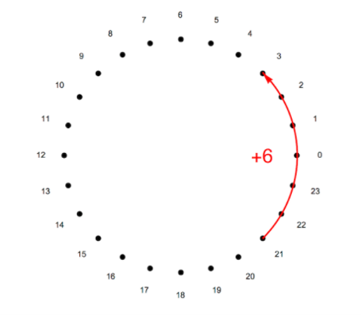

另一种方式是，我们考虑从-11到12的数字，这种方法使得我们自然地引入负数。注意到这只是为了方便表示，当对24取模时，-1和23没有区别。

    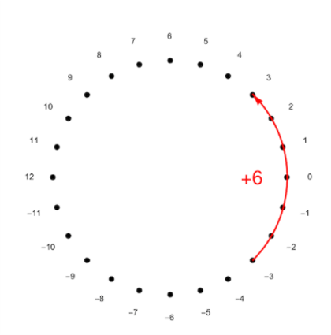

第二个不同是，同时也是最有意思的地方，就是全同态加密不仅仅对系数取模，同时还**对多项式本身取模**。

我们定义一个特别的多项式（称为*多项式模*），并且我们只考虑对这个“多项式模”取模之后的多项式（多项式除法参见[维基百科](https://en.wikipedia.org/wiki/Polynomial_long_division)）。在FV策略中，这个多项式模被定义为 $x^d+1$ ，其中 $d=2^n$ 。为了方便图示，这里我们取 $n=4$ ，也就是说多项式模为 $x^{16}+1$ 。

由于我们只考虑对 $x^16+1$ 取模之后的多项式，也即我们只需要考虑次数为 $x^0$ 到 $x^{15}$ 的多项式，任何次数更高的项都会被多项式模消去。我们也可以理解为 $x^{16} \equiv -1(mod \ x^{16}+1)$ ，意味着 $x^{16}$ 可以被-1代替，这样我们就可以把任意次数的项降低为 $x^0$ 到 $x^{15}$ 。

所以我们考虑的全部多项式都可以被表示为以下形式：

$$
\begin{aligned}
    & a_{15}x^{15}+a_{14}x^{14}+a_{13}x^{13}+a_{12}x^{12}+a_{11}x^{11}+a_{10}x^{10}+a_{9}x^{9}+ \\
    & a_{8}x^{8}+a_{7}x^{7}+a_{6}x^{6}+a_{5}x^{5}+a_{4}x^{4}+a_{3}x^{3}+a_{2}x^{2}+a_{1}x+a_{0}
\end{aligned}
$$

其中每个系数 $a_i$ 都介于0到 $t-1$ 之间。我们可以用下图来表示这些系数环：

    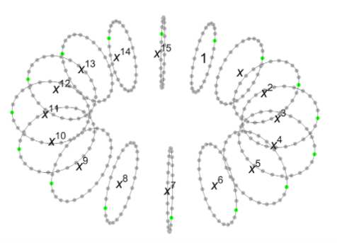

在上图中，每个环都表示对应项的系数的24个可能值，绿色点表示系数0的位置。这给了我们一种很好的方式来可视化多项式，并且在下文中表示加密和解密过程时这种方法会很有用。

FV策略包含很多多项式乘法，也就是把系数和次数分别相乘，例如当我们把 $2x^{14}$ 乘以 $x^4$ 时我们会得到 $2x^{18}$ ，别忘了我们还要把这个式子对我们的多项式模： $x^{16}+1$ 取模。如果只是简单地对 $x^{16}$ 取模，我们直接就能得到 $2x^2$ ，就像对整数取模的运算一样。**但是这个加一运算引入了一个非常有意思的符号变化，这有助于我们进一步打乱乘法运算的结果**。

    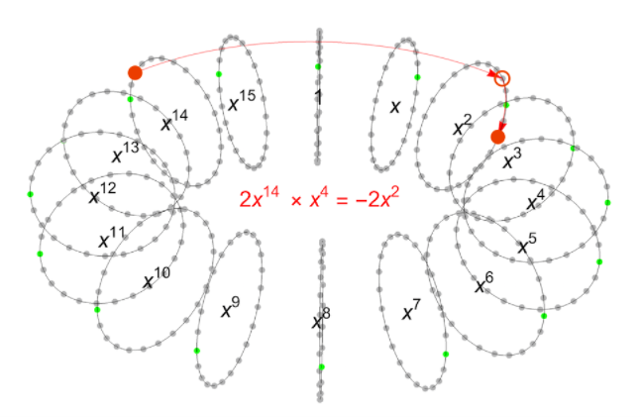

如上图所示， $2x^{14} \ * \ x^4 \ mod \ (x^{16}+1) \ = \ -2x^2$ 实际上代表着**把 $2x^{14}$ （也就是上图中的红点）顺时针旋转四个环，并将这个红点以零点为中心映射到另一边去**，这样我们就获得了 $22x^2$ （如果我们取系数从-11到12的话，我们将获得 $-2x^2$ ）。

这种形式的多项式有着非常有趣的结构和许多良好的特性，它们是环状多项式的一个子集。实际上，**选取一个多项式模并不是必须的，但它可以帮助我们加速计算**。

# 加密解密工作流程

现在我们已经介绍了FV策略中使用的多项式环，接下来我们将讨论加密解密的流程。首先我们将分析公钥和私钥的产生，然后再分析它们是如何用于加密和解密的。

## 公钥和私钥

加密过程接收一个明文，并使用从私钥获取的公钥来将其转换为密文。只有在你知道私钥的情况下，从明文到密文的流程才是可逆的。

更确切地说，明文是一个来自于多项式模为 $x^d+1(d=2^n)$ 的多项式环中的多项式，并且它的参数都对 $t$ 取余。而密文则使用两个来自于同一多项式环中的多项式来表示（也即多项式模为 $x^d+1$ ），但它们的参数都对 $q$ 取余，并且 $q$ 通常比 $t$ 大得多。

举个例子，多项式模为 $x^{4096}+1$ ，意味着多项式有 $d=4096$ 个系数。明文多项式的系数可能对 $t=290764801$ 取余，而密文多项式的系数可能对 $q=9214347247561474048$ 或者更大的数字取余。

为了方便图示，我们会使用一些小得多的数字，希望这能够让你更清楚地了解加密策略的每一步中都发生了什么。在这一部分中，我们取 $d=16, \ t=7, \ q=874$，注意这些参数是*不安全的*！！！（如果你想获取安全的参数，请参见[这篇报告](https://www.microsoft.com/en-us/research/wp-content/uploads/2017/12/sealmanual.pdf)的8.3节，在写作本文时它仍是有效的）。

我们记私钥（又称为密钥）为 $s$ ，首先我们生成一个随机的多项式，其系数为0、1或-1，例如：

$$
s=x^{15}-x^{13}-x^{12}-x^{11}-x^9+x^8+x^6-x^4+x^2+x-1
$$

接下来我们准备生成公钥，首先需要用到密文空间中一个随机的多项式 $a$ ，其系数全部对 $q$ 取模，例如：

$$
\begin{aligned}
    a= & 42x^{15}-256x^{14}-393x^{13}-229x^{12}+447x^{11}-369x^{10}-212x^9+ \\
    & 107x^8+52x^7+70x^6−138x^5+322x^4+186x^3−282x^2−60x+84
\end{aligned}
$$

同时我们还要定义一个*误差多项式*，它的系数比较小，且都来自于离散的高斯分布，这个多项式只会被使用一次，然后就被丢弃，例如：

$$
\begin{aligned}
    e= & −3x^{15}+x^{14}+x^{13}+7x^{12}−6x^{11}−6x^{10}+ \\
    & x^9+4x^8−x^6+3x^5−4x^4+4x^3+4x+1
\end{aligned}
$$

最后，我们定义公钥为这样一对多项式： **$PK=([-as+e]_q,a)$** ，此处的多项式运算全部在对多项式模取模的意义下进行，同时系数全部对 $q$ 取模。

对于上面给出的例子，我们可以用下面的图来表示公钥的计算结果：

    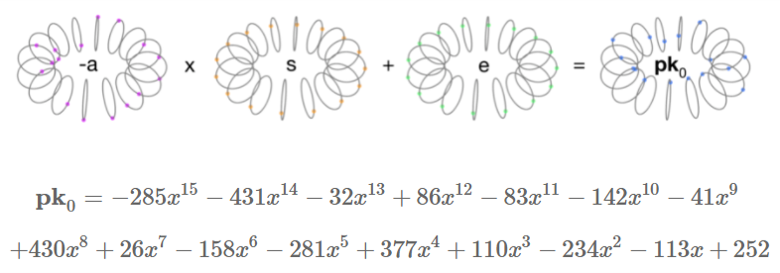

第一个乘法是将多项式 $a$ （系数对 $q$ 取模）与 $s$ 相乘，且 $s$ 的系数为0、1或-1，考虑到上文提到过的多项式乘法的“旋转与反射（译者注：即上文中提到的多项式环的旋转和反射）”性质， $a$ 的所有系数都被充分地扰乱了，误差项也被很好地引入了其中。多项式 $a$ 非常有效的掩盖了公钥中的密钥。

从公钥中破解加密策略基本上可以理解为从多项式对 $([-as+e]_q,a)$ 中获取私钥 $s$ 。这也就促使我们在加密方案中引入了误差项——如果 $e$ 为零，从公钥中获取 $s$ 是非常容易的。当 $e$ 足够大，但不是特别大时，破解私钥就成为了一个非常困难的问题——参考[原论文](https://eprint.iacr.org/2012/144.pdf)的6.1节来获取更多细节。

在上面用来图示描述的简单例子中，私钥可以被纯暴力攻击破解——只需要尝试每个可能的 $s$ （一共只有 $3^{16}=43,046,721$ 种组合），并寻找最接近公钥中的第一项（译者注：即 $-as+e$ ）的答案。对于真实的参数来说，纯暴力攻击是不可实现的—— $3^{4096}$ 是一个非常大的数字——但是实际上还有一些更聪明的方法，定义了一组给定参数的安全性。

## 加密

加密过程看起来跟公钥生成有些类似。

加密接受一个系数对 $t$ 取模的多项式，也即明文，并将它转换成一对系数对 $q$ 取模的多项式。为了便于表示，我们将加密一个非常简单的多项式消息：$m=3+4x^8 \equiv 3-3x^8$，它只有两个非零系数。

加密需要三个小多项式。两个误差多项式，参数从离散高斯分布中获取，这一分布与公钥生成中的误差多项式所使用的是相同的，另外一个多项式我们称为 $u$ ，它的系数是0、1或-1，就像私钥一样。

$$
\begin{aligned}
    e1= & −5x^{15}−2x^{14}+3x^{13}−x^{12}−4x^{11}+3x^{10}+x^9+4x^8 \\
    & +4x^7+5x^6−4x^5−3x^4−3x^3+2x^2−6x+4 \\
    e2= & −7x^{15}+2x^{14}−4x^{13}+5x^{11}+2x^{10}−x^9+4x^8 \\
    & −4x^7−3x^6+2x^5−2x^4+x^3−4x^2−2x+2 \\
    u= & x^{14}+x^{13}+x^{12}−x^8−x^5−x^3+1
\end{aligned}
$$

这些多项式在加密过程中被使用一次，然后就被废弃。

密文被表示为两个多项式，计算方式如下： $CT=([PK_0u+e_1+qm/t]_q,[PK_1u+e_2]_q)$ 。请注意明文出现的位置以及它是如何被引入式子的——明文中的系数全部对 $t$ 取模，然后它们被 $q/t$ 扩大了（在我们的例子中 $q/t=128$ ），这使得这些系数的范围扩展到了对 $q$ 取模。这是将明文插入密文时对明文的唯一的改变。明文的系数通过被添加到第一项中来掩盖，第一项的系数全部对 $q$ 取模，这使得第一项几乎与随机噪音无异。而 $u$ 的随机性改变了每次加密时使用的公钥项，确保相同的明文在不同的加密中产生不同的密文。

    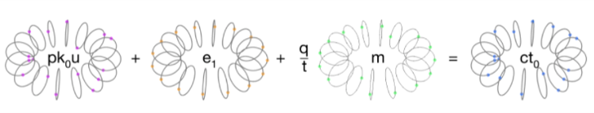

**同态加法和乘法之所以能够工作，是因为密文中的明文只经过了一个缩放变换。其他项的存在是为了隐藏明文，并且可以证明只有当攻击者知道私钥时才能够移除这些项。**

按上面的方法计算密文的第一项可以得到：

$$
\begin{aligned}
    CT_0= & 217x^{15}−53x^{14}+13x^{13}−249x^{12}−392x^{11}−238x^{10}+252x^9+115x^8 \\
    & +5x^7+184x^6−201x^5−258x^4−247x^3+144x^2+23x+42
\end{aligned}
$$

将密文第一项含有的公钥展开，我们可以得到 $CT_0=[e_1+eu-aus+qm/t]_q$ 。在这个展开式中，前两个项“比较小”，适合做为误差项，后两个项则“比较大”。第一个比较大的项实际上充分隐藏了第二个比较大的项，也就是明文。

密文的第二项被这样计算：

$$
\begin{aligned}
    CT_1= & 25x^{15}+225x^{14}−12x^{13}+270x^{12}+350x^{11}−24x^{10}+56x^9−330x^8 \\
    & +386x^7+225x^6−332x^5+68x^4−20x^3−26x^2−91x+380
\end{aligned}
$$

将密文第二项中含有的公钥产开，我们可以得到 $CT_1=[au+e_2]_q$ 。这其实展示了解密如何工作——如果我们知道 $s$ ，我们就能计算 $CT_1*s=[aus+e2s]_q$ ，而这可以被用于去除密文第一项中非明文的较大的项。

总的来说，明文可以被表示为公钥、私钥、掩码、噪声和明文，如下图所示：

    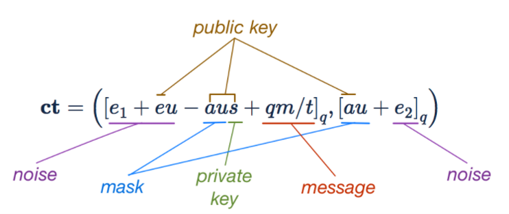

## 解密

如上文所述，解密过程也比较简单。首先我们计算 $[CT_0+CT_1*s]_q$ ，这可以去除明文中的全部掩码。计算上式我们可以得到 $[qm/t+e_1+eu+e_2]_q$ ，也就是缩放后的明文加上一些噪声项。于是，考虑到这些噪声项并不是很大，我们就可以复原明文。

    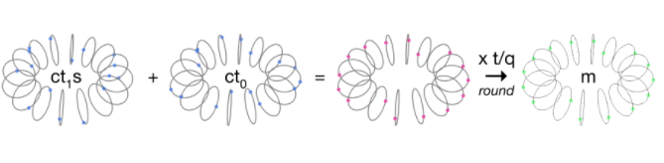

确切地说：

$$
\begin{aligned}
    CT_1*s+CT_0= & 13x^{15}−2x^{14}+17x^{13}+22x^{12}−32x^{11}−23x^{10}+19x^9−380x^8 \\
    & +9x^7+10x^6−13x^5−3x^4−2x^3−12x^2+7x+393
\end{aligned}
$$

此处你能看到除了明文的两个非零系数（也就是 $x^8$ 和 $x^0$ ）之外，所有的系数都小于 $q/t=128$ 。如果我们把这个多项式重新对 $t$ 取模，那么我们有：

    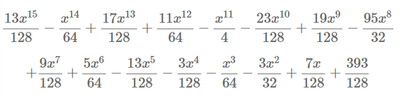

对这些系数四舍五入，我们就能恢复我们的明文：

$$
m=3-3x^8
$$

在上面的计算中，我们通过将缩放后的系数四舍五入到最接近的整数中来获取我们的明文：

    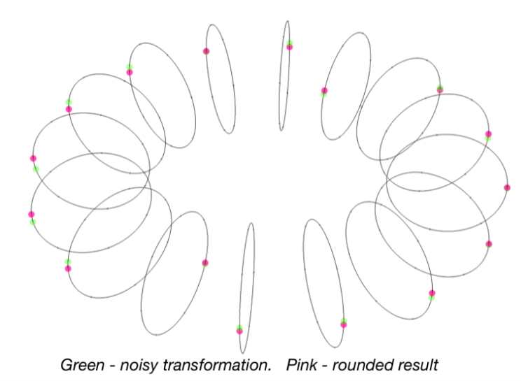

把上面的内容综合起来，我们可以用以下式子来表示解密过程：

$$
m'=[\lfloor \cfrac{t}{q}[CT_0+CT_1*s]_q \rceil]_t
$$

此处 $\lfloor\rceil$ 表示取整到最近的整数。

**如果系数受到噪声的影响太大，它们可能会最终变成一个不正确的整数，此时解密会（悄悄地）失败并产生不正确的结果。** 在上面的例子中，最大误差为 $13/128$ ，所以仍可以容忍一些噪声并产生正确的结果，噪声的容忍程度可以用 $q/t$ 来调整。

# 同态加法和乘法

人们对这一类加密方案感兴趣的主要原因之一是，它们允许同态加法和乘法。这意味着你可以在数字被加密的情况下进行加法和乘法，而无需事先解密它们。这是一个非常惊人的能力，有望在数据保护和数据安全方面设立一个新的黄金标准。

## 同态加法

最简单的情况是两个加密后的数字相加。假设我们用相同的公钥加密了两个多项式， $m_1$ 和 $m_2$ 。

$$
\begin{aligned}
    a=([PK_0u_1+e_1+qm_1/t]_q,[PK_1u_1+e_2]_q) \\
    b=([PK_0u_2+e_3+qm_2/t]_q,[PK_1u_2+e_4]_q)
\end{aligned}
$$

注意到我们需要两个小多项式 $u_1$ 和 $u_2$ ，以及四个小噪声多项式 $e_1...e_4$ 来完成这一过程。

如果我们只是将两个密文的对应项相加，我们会得到一个新的密文：

$$
a+b=([PK_0(u_1+u_2)+(e_1+e_3)+q(m_1+m_2)/t]_q,[PK_1(u_1+u_2)+(e_2+e_4)]_q)
$$

由于密文中的明文只经过了一个缩放变换，所以这个加法的结果与带新的噪声项的 $m_1+m_2$ 的加密形式相同：

$$
c=([PK_0(u_3)+(e_5)+q(m_1+m_2)/t]_q,[PK_1(u_3)+(e_6)]_q)
$$

在取整前的近似解密结果是（译者注：此处的 $e$ 是公钥中使用的误差项）：

$$
[q(m_1+m_2)/t+e_5+eu_3+e_6s]_q
$$

这意味着如果新的误差项不是太大，明文 $m_1+m_2$ 就能被正确解密。此处有三种噪声项：

$$
\begin{aligned}
    e_5= & e_1+e_3 \\
    eu_3 = & e(u_1+u_2) \\
    e_6s = & (e_2+e_4)s
\end{aligned}
$$

我们担心的是当这些项变得足够大，某个噪声多项式的其中一个系数就有可能变得比 $q/(2t)$ 还要大，此时解密就会失败——由于解密过程最后的取整操作会获得一个错误的数字。

如果我们只考虑第一个误差多项式，那么实际上我们是将两个系数都来自于离散高斯分布的多项式相加。这意味着在某些情况下我们可能会把一个负系数加到一个正系数上，结果也更接近于零。在其他情况下系数则会有相同的符号，并使得计算结果变得更大。我们尝试着做了很多同态加法，并看看误差项是如何随着加法次数的增加而增加的。系数的分布如下所示，我们分别把1、5和30个错误多项式相加来获取结果（进行了几百次随机实验）：

    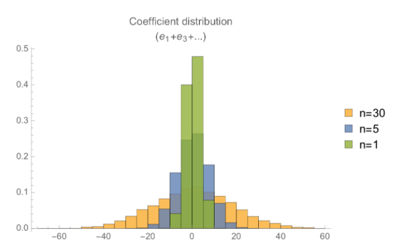

当我们将30个误差多项式相加的时候，有一定的可能一些系数会大于64，也就是本例中 $q/t$ 的一半，此时解密将不会产生正确的结果。

另外两项的情况则有所不同——第二项是误差多项式乘以一些“小多项式（系数为0、1或-1）”的和。这样的乘法会导致更大的噪声。误差多项式和小多项式的乘积的系数大概是 $\frac{2}{3}$ 的噪声多项式的系数（正负号随机）的和。这意味着这个误差项随着多项式大小的平方根而变化，也就是 $\sqrt{n}$ 。

    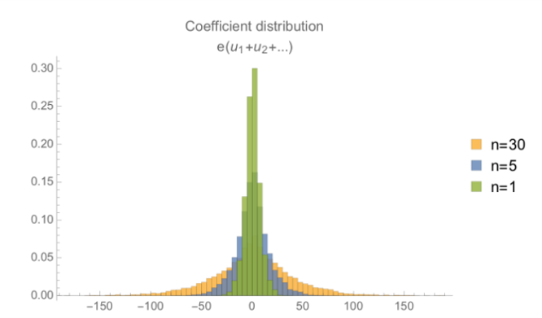

第三项类似，它是一组误差多项式的和，乘以一个“小多项式”，其误差分布就像这样：

    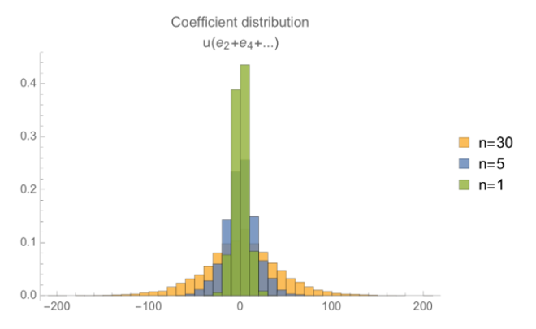

结合来看，我们可以得到三个项的最大系数的增长情况，它是一个以同态加法次数做为自变量的函数。这里我们将它表示为箱型图，以便更直观地表示这些最大系数的变化情况（注意误差的平均值接近于零，而这张图是最大系数的值的分布）。

这表明对于我们所选择的参数，当我们解密由两次以上的同态加密所产生的密文时，出现错误的概率非常高。并且即使在解密两次同态加密时也有一定的失败概率，这是因为当 $q/t=128$ 时，有时最大误差会大于64，这就会导致失败的解密。为了容忍更大的同态加法所产生的误差，我们需要使用一个大得多的 $q/t$ ，才能解决由同态加法次数所引入的噪声。

不幸的是，由密文的同态乘法所引入的噪声更要大得多。

## 同态乘法

程序上来讲，同态乘法非常简单，但比同态加法要复杂得多。如上所述，出现在密文第一项中的明文只是缩放为了 $qm_1/t$ 。所以将两个密文的第一项相乘再乘以 $t/q$ 将会生成这样一个项： $qm_1m_2/t$ ——如果我们可以去除掩码项，这一项就仍然是可以恢复的。

那么，理解同态乘法机制的诀窍就在于如何去除掩码项。为了做到这一点，我们的想法是把密文看成私钥 $s$ 的幂的简单多项式。这是本文中使用多项式的第三种方式，可能会有点令人困惑，但这是理解同态乘法的关键。

我们可以写出解密过程的第一部分，使得密文的每个元素都是多项式 $s$ 的一个系数：

$$
[CT_0+CT_1s^1]_q
$$

此时 $CT$ 和 $s$ 都是多项式，所以上式可以理解为一个多项式乘以1（也就是 $s^0$ ）再加上一个多项式乘以另一个多项式，之后再对 $x^d+1$ 取模，系数对 $q$ 取模。

不难看出上面的解密产生了一个独立于掩码项 $au$ 的数量值：

$$
[CT_0+CT_1s^1]_q \rightarrow \frac{q}{t}m+noise
$$

现在考虑两个密文 $a$ 和 $b$ ，也就是两个明文（也即 $m_1$ 和 $m_2$ ）的加密结果，可以被解密为下面的形式：

$$
\begin{aligned}
    [a_0+a_1s^1]_q\rightarrow\frac{q}{t}m_1+n_1 \\
    [b_0+b_1s^1]_q\rightarrow\frac{q}{t}m_2+n_2
\end{aligned}
$$

上式中 $n_1$ 和 $n_2$ 表示密文中的噪音。如果我们计算它们的乘积，我们有：

$$
[a_0+a_1s^1]_q[b_0+b_1s^1]_q\rightarrow(\frac{q}{t}m_1+n_1)(\frac{q}{t}m_2+n_2)
$$

式子右边的项对于计算 $a$ 和 $b$ 时使用的掩码是独立的，那么式子左边的项也应该是独立的。

这样做意味着我们可以构造出一个新的密文，该密文比原来的密文多一个元素，而且可以仅使用私钥 $s$ 的幂就可以正常解密。

在此处我们可以扩展解密的定义以适应对这种新密文的解密，如下所示：

$$
[\lfloor \cfrac{t}{q}[CT_0*s^0+CT_1*s^1+CT_2*s^2]_q \rceil]_t
$$

这种新密文仅仅增加了一个项，即一个多项式乘以另一个多项式的平方。可能会增加一些计算量，但是也只是学生水平的代数计算罢了（至少在多项式取模部分之前都是）！这是对解密过程的一个概括，它允许我们对同态乘法的结果进行解密。

为了详细了解这一切是如何运作的，考虑在加密过程中展开 $a$ 和 $b$ ，如下所示：

$$
\begin{aligned}
    a = [PK_0u_1+e_{11}+qm_1/t,PK_1u_1+e_{12}] \\
    b = [PK_0u_2+e_{21}+qm_2/t,PK_1u_2+e_{22}]
\end{aligned}
$$

如果我们扩展乘法的定义，并部分解密结果（也即解密到除以 $q/t$ 和进行取整操作之前），那么得到的式子就会相当复杂。但是由于每个密文的结构决定了它们能够在解密时移除掩码项（ $au_i$ ），也就意味着这个扩展的解密结果完全不依赖于从公钥中获取的掩码项 $a$ ！！！表达式给出如下，它在一定程度上展示了乘法结果中的噪声项：

$$
\begin{aligned}
    & CT_0*s^0+CT_1*s^1+CT_2*s^2= \\
    & \frac{q}{t}m_1m_2+e_{22}m_1s+e_{12}m_2s+em_2u_1+em_1u_2+e_{21}m_1+e_{11}m_2 \\
    & +\frac{t}{q}e^2u_1u_2+\frac{t}{q}e_{12}e_{22}s^2+\frac{t}{q}e_{22}esu_1+\frac{t}{q}e_{12}esu_2 \\
    & +\frac{t}{q}e_{12}e_{21}s+\frac{t}{q}e_{11}e_{22}s+\frac{t}{q}e_{21}eu_1+\frac{t}{q}e_{11}eu_2+\frac{t}{q}e_{11}e_{21}
\end{aligned}
$$

的确有很多项！但是我们目前已经去除了掩码，问题是，这些误差项（除了第一项之外全部是误差项）究竟有多大？与我们的”误差限度“ $q/(2t)$ 相比这些误差又如何呢？

我们模拟了大量对随机明文进行加密后的同态乘法，取： $d=16$ 、 $t=7$ 、 $q=7168=1024*t$ 。每一个误差项的参数的大小的分布如下图所示。注意总误差必须要大于 $q/(2t)=512$ 才能造成解密错误。这些项包括误差多项式、明文和私钥， $e_{22}m_1s+e_{12}m_2s$ 是最大的误差。 

    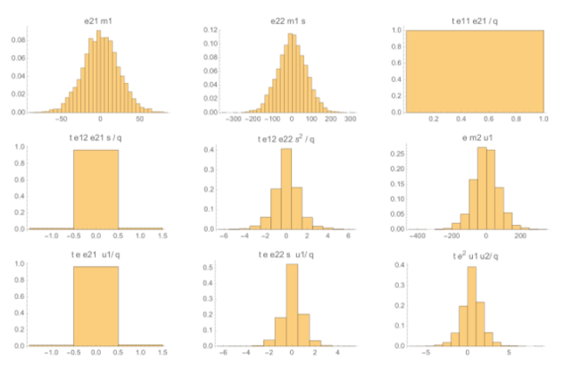

这张图表示出最大的误差来自于误差多项式、明文和私钥的乘积，这种噪声的最大系数大约为300。除了这一类项（共有两个）之外，其他的误差项都比较小。这张图显示了把同态乘法的所有误差项合并起来之后系数的分布：

    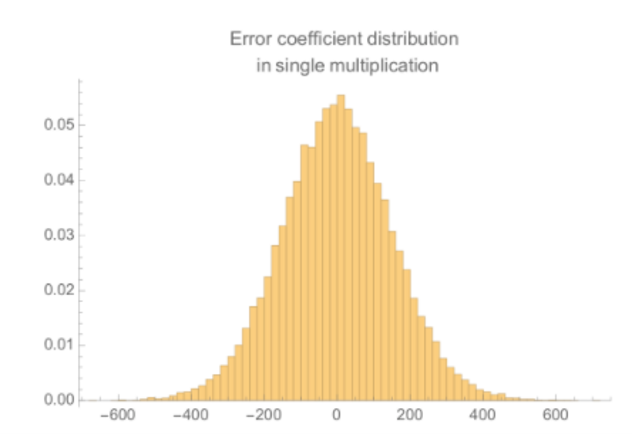

这表明对于我们选取的参数（反正不安全！）来说，完全不能容忍一次同态乘法所带来的噪声并进行一次安全的解密——在4000个系数中大约有1个系数的误差会大于512，这导致解密的错误率大约为1%。

总结一下，如果我们把密文视为私钥 $s$ 的多项式，并在解密时抵消自身的掩码项，我们就能够对密文执行同态乘法运算。分别跟踪 $s$ 的幂的系数的大小和噪声的大小，这样我们就能顺利对同态乘法的结果进行解密。

## Relinearisation 和其他

上文中描述的同态乘法策略允许我们进行多次乘法，代价是每次乘法都会使得密文的大小增加一个多项式。在实际应用中，密文太长的话也会成为一个问题。实际上，**有一些方法可以把密文重新减小为两个多项式**，代价是增加一些噪声，这被称为“Relinearisation（重线性化）”，因为你尝试着删除关于 $s$ 的多项式中的二次项和更高次数的项。

使用这种加密策略的另一个实用技术是：**将多个信息“打包”进一个明文中，来通过并行化来提高吞吐量**。

Relinearisation 和这些“打包”的编码机制将在后续博文中进一步讨论。

# 结论

大体来说，FV策略的加密过程是：**在一个带有噪声的多项式环中对信息添加掩码后嵌入，每个密文都含有足够的信息以便于在给定密钥的情况下去除自身的掩码。同时由于掩码的嵌入只涉及到信息的缩放，所以加法和乘法仍然对这些信息有效，并且通过一些巧妙的构造方法，我们能够在加法和乘法后去除掩码**。这种方案的安全性在于：**在噪声存在的情况下去除掩码是困难的**。这一困难问题有很多优秀的安全性质，例如没有已知的量子算法来攻击这一加密策略。

如果你已经看到这里，我们希望你现在对 Ring Learning With Error 同态加密方案（或者至少是这一方案的FV版本）的工作原理有了更好的了解。同时写作这篇文章的过程对笔者也大有裨益。

# Acknowledgements

感谢 Wilko Henecka 和 Hamish Ivey-Law 的反馈，这些反馈大大改进了这篇文章！