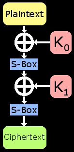
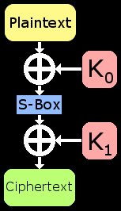
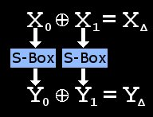
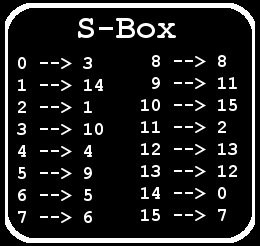
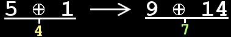
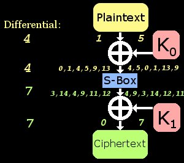

[原文地址](http://theamazingking.com/crypto-diff.php)

---

关于这种破解密码的方法（译者注：即差分密码分析）已经有了很多介绍，但我很难找到一个简明而完整的关于如何实现这些攻击的教程。在弄清这一攻击方法的过程中，我并没有真正使用一份“参考资料”；相反，我阅读了大量论文，最终了解了它的工作流程。我认为现有论文大多略过恢复密钥的过程而更多地关注差分本身。在这篇文章中，我将尝试着平衡这两个主题，并详细解释这种技术是如何工作的。

源代码如下：

```c
//Jon King
//Differential Cryptanalysis Toy Implementation

#include <stdio.h>

int sbox[16] = {3, 14, 1, 10, 4, 9, 5, 6, 8, 11, 15, 2, 13, 12, 0, 7};
int sboxRev[16] = {14, 2, 11, 0, 4, 6, 7, 15, 8, 5, 3, 9, 13, 12, 1, 10};
int chars[16][16];


int roundFunc(int input, int key)
{
    return sbox[key ^ input];    
}

int encrypt(int input, int k0, int k1)
{
    int x0 = roundFunc(input, k0);
    return x0 ^ k1;        
}

void findDiffs()
{
    printf("\nCreating XOR differential table:\n");
    
    int c, d, e, f;
    
    for(c = 0; c < 16; c++)
        for(d = 0; d < 16; d++)
            chars[c ^ d][sbox[c] ^ sbox[d]]++;        
 
    for(c = 0; c < 16; c++)
    {
        for(d = 0; d < 16; d++)
            printf("  %x ", chars[c][d]);
        printf("\n");
    }
    
    printf("\nDisplaying most probable differentials:\n");
    
    for(c = 0; c < 16; c++)
        for(d = 0; d < 16; d++)
            if (chars[c][d] == 6)            
                printf("  6/16:   %i --> %i\n", c, d);  
}

int knownP0[10000];
int knownP1[10000];
int knownC0[10000];
int knownC1[10000];

int goodP0, goodP1, goodC0, goodC1;

int numPairs;

//int realk0, realk1;

int chardat0[16];
int chardatmax = 0;

void genCharData(int indiff, int outdiff)
{
            printf("\nGenerating possible intermediate values based on differential(%i --> %i):\n", indiff, outdiff);
    
            chardatmax = 0;
            int f;
            for(f = 0; f < 16; f++)
            {
                int myComp = f ^ indiff;
                
                if ((sbox[f] ^ sbox[myComp]) == outdiff)         
                {
                    printf("  Possibles:   %i + %i --> %i + %i\n", f, myComp, sbox[f], sbox[myComp]);
                    chardat0[chardatmax] = f;
                    chardatmax++;
                }
            }    
}

void genPairs(int indiff)
{
    printf("\nGenerating %i known pairs with input differential of %i.\n", numPairs, indiff);
    
    int realk0 = rand() % 16;                                                       //Create random subkey0
    int realk1 = rand() % 16;                                                       //Create random subkey0
    
    printf("  Real K0 = %i\n", realk0);
    printf("  Real K1 = %i\n", realk1);
    
    
    int c;
    for(c = 0; c < numPairs; c++)                                               //Create plaintext pairs with XOR difference of indiff
    {
        knownP0[c] = rand() % 16;
        knownP1[c] = knownP0[c] ^ indiff;
        knownC0[c] = encrypt(knownP0[c], realk0, realk1);
        knownC1[c] = encrypt(knownP1[c], realk0, realk1);
    }  
}

void findGoodPair(int outdiff)
{
    printf("\nSearching for good pair:\n");
    int c;
    for(c = 0; c < numPairs; c++)
        if ((knownC0[c] ^ knownC1[c]) == outdiff)                               //Does the ciphertext pair fit the characteristic?
        {   
            goodC0 = knownC0[c];
            goodC1 = knownC1[c];
            goodP0 = knownP0[c];
            goodP1 = knownP1[c];   
            printf("  FOUND GOOD PAIR: (P0 = %i, P1 = %i) --> (C0 = %i, C1 = %i)\n", goodP0, goodP1, goodC0, goodC1);        
            return;    
        }     
    printf("NO GOOD PAIR FOUND!\n");
}

int testKey(int testK0, int testK1)
{
    int c;
    int crap = 0;
    for(c = 0; c < numPairs; c++)
    {
        if ((encrypt(knownP0[c], testK0, testK1) != knownC0[c]) || (encrypt(knownP1[c], testK0, testK1) != knownC1[c]))
        {
            crap = 1;
            break;
        }        
    }
    
    if (crap == 0)
        return 1;     
    else   
        return 0;   
}

void crack()
{
    printf("\nBrute forcing reduced keyspace:\n");
    
    int f;
    for(f = 0; f < chardatmax; f++)                                             //Test each possible value based on characteristic
    {
        int testK0 = chardat0[f] ^ goodP0;
        int testK1 = sbox[chardat0[f]] ^ goodC0;

        if (testKey(testK0, testK1) == 1)
            printf("  KEY! (%i, %i)\n", testK0, testK1);
        else
            printf("       (%i, %i)\n", testK0, testK1);
    }  
}

int main()
{
    srand(time(NULL));                                                          //Randomize values per run
    
    findDiffs();                                                                //Find some good differentials in the S-Boxes
    
    numPairs = 8;                                                               //Define number of known pairs
    
    genCharData(4, 7);                                                          //Find inputs that lead a certain characteristic
    genPairs(4);                                                                //Generate chosen-plaintext pairs
    findGoodPair(7);                                                            //Choose a known pair that satisfies the characteristic
    crack();                                                                    //Use charData and "good pair" in find key                                                               

    while(1){}
    return 0;    
}
```

这个用C语言写成的程序实现了“玩具密码（译者注：下文中会进行介绍）”的简化版本，并计算出其最有可能的差分特征，随后显示一个选定的差分特征（4->7）的所有可能的输入输出对。它能够在比暴力穷举更短的时间内恢复密钥。我建议在阅读本文时同步阅读代码，从 `main()` 开始，逐步检查各个部分，这可能会加速你走向“Eureka！”的时刻。

# 我们的目标

我马上将会描述一个可以用差分密码攻击来破解的玩具密码，它是一个非常简单的2轮SPN结构密码，只使用了S盒和基于异或的密钥混合。这一密码接受一个4比特输入和8比特密钥，并且输出4比特密文。首先，明文与密钥的前四位（称为子密钥$K_0$）异或，并被送入一个4比特的S盒（这是为了为密码提供非线性），随后S盒的输出与密钥的后四位（称为子密钥$K_1$）异或，并且再次送入S盒。敏文的分块大小非常小，这使得S盒的尺寸也很小，便于读者学习，实际上，读者甚至可以在纸上手动完成这一加密过程。

我们将在后面的章节中定义S盒的实际内容，现在我们只需要说S盒是一个双射，这意味着每一个输入都有着一个唯一确定的输出，同时每一个输出也对应着一个唯一确定的输入。换言之，如果人们知道了S盒的输出，他们将能够很容易地恢复与之对应的输入。我们不难发现：如果一个密码仅仅使用S盒，那么攻击者能够利用S盒的输出来轻易地获取输入；如果一个密码仅仅使用异或，那么攻击者可以利用异或的性质（$a\bigoplus b=c,a\bigoplus c=b$，译者注）来恢复密钥；而当我们将这两个功能结合使用，密码的安全性就得到了极大的改善。

<div align=center>
    
</div>

# 简化目标

简化密码对攻击来说通常有着极大帮助，删除一些不必要的部分能够大大降低运算工作量。请记住，S盒是时刻被攻击者所知的，同时它也是可逆的，这意味着如果我们知道一些密文，那么我们也能直接确定最后一个S盒的输入，也即最后一个S盒没有提供任何安全性，可以在攻击中被忽略。基于这一事实，我们需要破解的部分就只剩下异或、S盒和异或了，即使我们知道一组明文和它们对应的密文，异或却从代数角度阻止了我们获取两个子密钥（$K_0$和$K_1$）。

直观地想，我们只要测试$K_0$和$K_1$的每种可能性就能够破解密码，这意味着蛮力破解这一玩具密码的预期时间是$2^8$。然而需要注意，由于密钥的比特位比明文更多，对于一个明文密文对，可能有多个密钥能够完成加密流程，这一问题将导致：一旦攻击者想要测试一个密钥是否正确，他就必须对手头的所有明文密文对进行测试。

事实上，我们并不需要测试每一个$K_0$和$K_1$，如果我们猜测了一个$K_0$，并且有一些已知的明文密文对，通过一些基本的代数运算，我们将能够找到这一$K_0$所对应的$K_1$的合理猜测：我们只需要将$K_0$的猜测与一个已知的明文进行异或，并将其作为S盒的输入，再将S盒的输出与密文进行异或（这里就利用了异或的性质，译者注），我们就获得了一个关于$K_1$的合理猜测，接下来你只需要验证$K_0$和$K_1$构成的密钥能否满足其他明文密文对即可。这种更聪明的暴力破解方法只需要$2^4=24$次猜测就可以破解玩具密码了。

<div align=center>
    
</div>

# 攻击概述

但是，我们希望仅仅通过$6$次猜测而非$24$次猜测就破解玩具密码！为了完成这一攻击，我们不仅需要已知的明文密文对，我们还需要选择一个明文并且获得他们的输出，**而差分攻击就是一种基于选择明文攻击的密码攻击**。在差分攻击的模型中，攻击者能够使用某一未知的密钥对他选择的数据进行加密，同时通过分析加密结果，攻击者就能够确定正在使用的密钥。一旦攻击者以这种方式成功获取了密钥，未来使用这一密钥进行的传输就可以迅速解密——诚然，这种攻击发生在现实生活中的概率是值得怀疑的，但它有可能发生，互联网和自动化数据系统的崛起将会使得这种情况发生的概率比看起来要大得多。

# 差分性质

<div align=center>
    
</div>

假设我们有两个值$X_0$和$X_1$，这两个值的异或差分（简称为差分，译者注）被定义为$X_0\bigoplus X_1$。请回顾一下玩具密码的加密原理图，如果我们知道了S盒的输出，我们不就能破解密码了吗！尽管我们不知道，我们却可以从中获得一些关于这个值的信息并加以利用。差分特性有一个非常有趣的性质：异或不会改变它们。我们不能得到S盒输出的原因是$K_1$的密钥混合把它隐藏了起来，但是，这种异或并不会改变两个值之间的差分——值本身会随着异或而改变，但值之间的关系（也即差分，译者注）不会改变。用数学语言表达就是：$X_0\bigoplus X_1=(X_0\bigoplus K_0)\bigoplus (X_1\bigoplus K_1)$，注意，**值之间的差分仅仅在碰到S盒的时候才发生改变**。

幸运的是，S盒不可能是完美的，一些传统的统计分析将揭示输入差分在通过S盒时可能会被转化为什么。当我们在计算输出差分时，也要考虑可能产生这种输出差分的输入值（也即$X_0$和$X_1$）。假设我们知道一个差分特征，在16次中有6次，S盒的两个随机输入值异或得到4，同时当这些值通过S盒并再一次异或后得到7，我们就可以说：差分特征“4-->7”在该S盒中以$\frac{6}{16}$的概率成立。请注意，只有6个实际值可以产生这样的差分特征，这一事实将在后面发挥作用。

# 寻找差分特征

<div align=center>
    
</div>

寻找差分特征的过程是非常直接的，我们枚举每个可能的4比特$X_0$，并与可能的每个$X_1$进行异或，异或的结果被称为输入差分，并且它作为我们建立的差分特征表的一行，而$X_0$和$X_1$经过S盒后的输出结果的异或值作为差分特征表的列。

我们要寻找的是在差分特征表中出现频率较高的输入差分和输出差分对，换言之，如果两个输入满足输入差分，那么它们对应的输出的差分也很可能满足输出差分。如果我们能找到一个好的差分特征，我们不需要知道实际的特征值就可以运用它。在我们的例子中，差分特征“4-->7”出现了6次（总共16次），这一特征将帮助我们很快找到破解密码的关键，产生这一特征的一个实例如下所示：

<div align=center>
    
</div>

# 选择明文

现在我们已经找到了概率很高的输入差分，我们将开始攻击（攻击的成功率与输入差分的概率有关，译者注）。记住，这是一个选择明文攻击，我们将成对地生成明文密文对。首先，随机生成一个明文$P_0$；接下来，将其与输入差分（在我们的例子中是4）异或来获取第二个明文$P_1$；最后，通过密码（采用未知的密钥）加密$P_0$和$P_1$来获取密文$C_0$和$C_1$。如果我们发现$C_0\bigoplus C_1$等于我们所选定的输出差分7，我们将它称为“好配对”，我们只需要找到一个好配对就可以停止寻找了，剩余的“坏配对”可以用来验证密钥的猜测（当然也可以选取其他的随机明文密文对）。

# 寻找密钥

<div align=center>
    
</div>

上图展示的是一个应用于密码的好配对，我一直不明白差分密码攻击是如何实现比蛮力攻击更小的时间复杂度的，直到我在纸上画了一个类似的示意图。示意图左侧是其中一个输入$X_0$，右边则是另一个输入$X_1$，注意在图中我们有$X_0\bigoplus X_1$等于输入差分4；同时还能注意到输出的密文差分得到7，这使得它成为了一个“好配对”。注意，我们不知道的是S盒的实际输入和输出，而只有6个输入输出对能够产生“4-->7”的差分特征，**这意味着中间的那些未知值一定属于这些输入输出对**！

图中列出了所有可能的值（这些值都是在寻找差分特征的过程中预先计算的）。通过猜测S盒的一个输入为9，我们也就能猜测出S盒的输出为11，通过基本代数运算，我们就能进一步猜测$K_0$值为8，$K_1$值为11。[在这一例子中](http://theamazingking.com/images/crypto-diff7.JPG)，这就是正确答案，我们可以通过对一些明文密文对（主要是坏配对）进行测试来验证这一点；而如果这不是正确答案，也没关系，我们只需要再测试5个可能的密钥即可，**我们需要猜测的密钥数量等于这一差分特征成立的概率**。在这一例子中我们有六个可能的密钥，因为差分特征成立的概率是$\frac{6}{16}$。**因此，使用一个概率为$\frac{2}{16}$的差分特征会使得对可能密钥的搜索更快，但会使我们更难找到好配对**。

# 干得不错！

虽然花了一些时间，但我终于明白了这种技术要如何应用到实际中，如果你还没有搞清楚，可以回顾一下最后一张图，它是我理解这一攻击的关键。差分密码攻击并不会直接恢复密钥，而是会把可能的中间值的范围减少到可以计算——在上面的例子中，我们在6次猜测之后就恢复了密钥，而非蛮力破解的16次。我的代码中实现攻击的成功完全取决于找到一个“好配对”。我把代码修改为运行100次并计算成功的密钥恢复次数：如果使用4个明文密文对，攻击成功概率是75%；如果使用8个明文密文对，攻击成功概率是95%左右；如果使用16个明文密文对，攻击成功概率提升到了100%。你可以参考代码来获取更详细的信息。

像往常一样，我欢迎对这篇文章的任何评论。如果你对如何改进这篇文章有任何想法，请给我发电子邮件。同时，永远不要失去对知识的渴望。

# 攻击的扩展

在现实世界中，已知明文攻击比选择明文攻击更有可能发生，出于这一原因，最好能将差分密码攻击扩展到已知明文攻击中。实际上，这一扩展非常简单，我很快就会实现它并在这里发布。你只需要截获一些明文密文对，并将他们相互之间进行比较，当你根据你选择的差分特征找到了一个好配对时就停止收集数据。例如，如果已知$P_0\bigoplus P_1$为4（我们的输入差分），并且已知$C_0\bigoplus C_1$为7（我们的输出差分），这样我们就找到了一个好配对，借此我们就能实现差分密码攻击的已知明文变体。在这个2轮玩具密码的例子中，你甚至可以使用任何出现过的差分特征来进行测试——但请记住，实际中进行的测试次数越多，需要的时间就越长，我们的目标是比蛮力破解更快地找到密钥，因此选取一个合适的差分特征是非常必要的。

差分攻击也可以适用于2轮以上的攻击（现实世界中的密码往往会运行许多轮），做到这一点的方法是把不同轮的差分特征连起来构成一条链。如果玩具密码有3轮，那么它可以被简化成“XOR-->SBOX-->XOR-->SBOX-->XOR”。例如：第一轮差分特征“4-->7”的概率是$\frac{6}{16}$，第二轮差分特征“7-->11”的概率是$\frac{4}{16}$，基于这两个差分特征，我们选取的明文的输入差分应当为4，而好配对的输出差分则为11。这种“链式关系”可以为我们提供分析多轮密码的合理概率，而且不同于蛮力破解所需要测试的256个密钥，我们只需要测试$6\times 4=24$个密钥即可。注意：破解第一轮时可能只需要测试4个子密钥，我对此并不确定，这种改进可能会成为我的下一个教程的一部分。